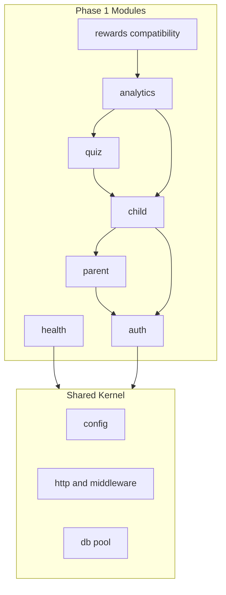
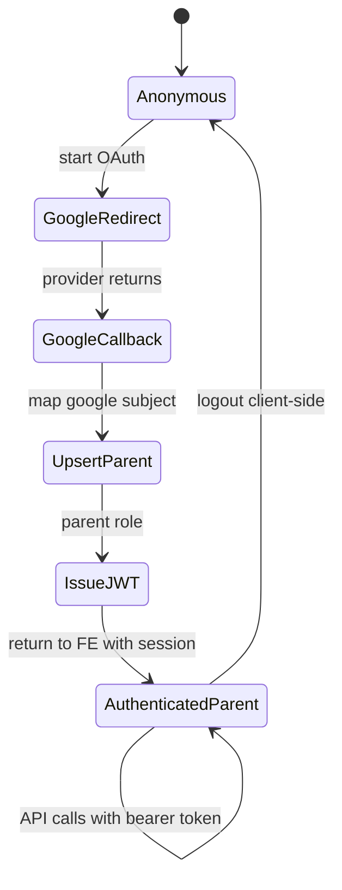
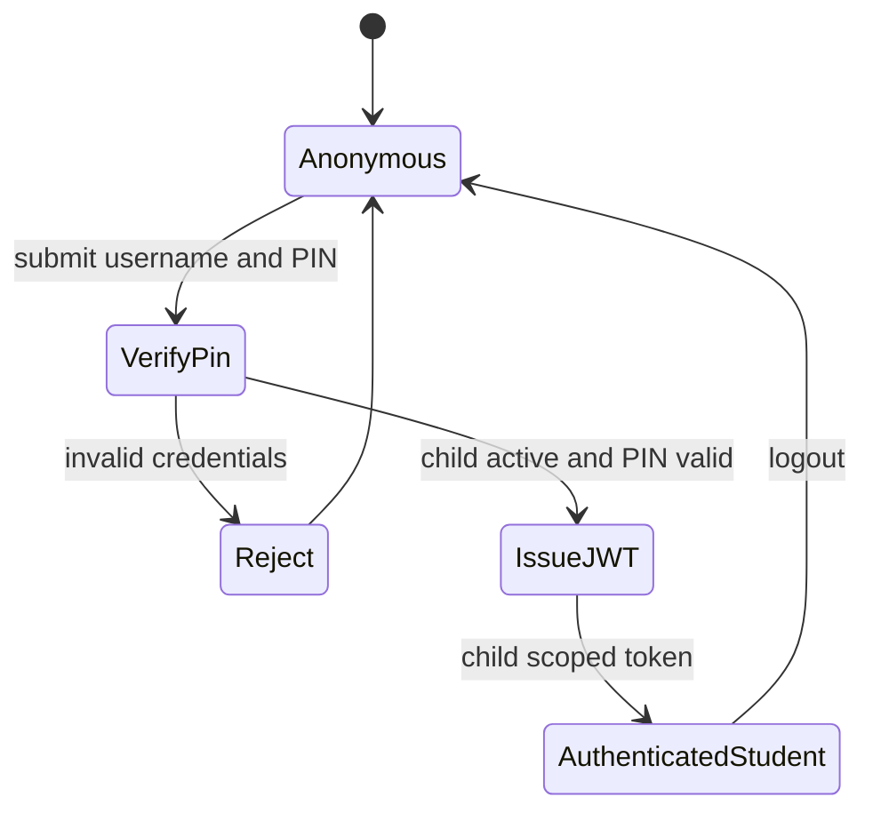
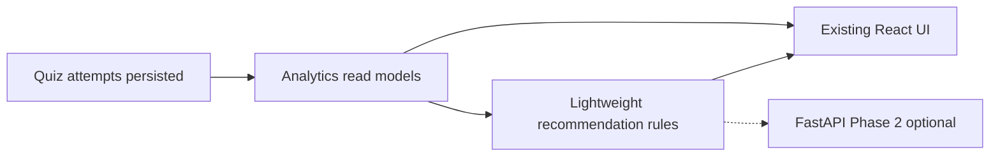

# Adaptive Learning System — Backend Architecture (Approved)

**Status:** Architecture-first planning **approved**. Implementation generation **not started**.

**Approved constraints:** Existing React frontend unchanged (no rewrite). Backend greenfield. Modular monolith. Compatibility-first. No overengineering. FYP-realistic scope. Single Node + PostgreSQL until scale demands otherwise.

---

## Approval record

| Decision              | Resolution                                                          |
| --------------------- | ------------------------------------------------------------------- |
| Architecture approach | Layered modular monolith, microservice-ready boundaries             |
| Frontend              | No rebuild; backend restores behavioral compatibility               |
| MVP intelligence      | Compute-on-read analytics; lightweight recommendation rules         |
| AI / FastAPI          | Phase 2+ only; no premature AI architecture                         |
| Parent auth           | Google OAuth 2.0 (primary); children **never** use Google           |
| Student auth          | Username + PIN on child record                                      |
| Admin                 | Role-ready JWT and middleware; no admin UI in Phase 1               |
| Rewards               | Compatibility layer only — FE derives gamification from analytics   |
| Infrastructure        | No premature fragmentation, queues, or multi-service deploy for FYP |

---

## 1. Finalized module boundaries (Phase 1)

Phase 1 modules are **approved as the only deployable domains** in the first implementation cycle. Each module is a vertical slice: edge handlers, application services, repositories, and module-local validators.

### Module catalog

| Module                    | Phase | Purpose                             | Internal scope                                                                                                                                                                |
| ------------------------- | ----- | ----------------------------------- | ----------------------------------------------------------------------------------------------------------------------------------------------------------------------------- |
| **health**                | 1     | Ops and FE connectivity             | Liveness only                                                                                                                                                                 |
| **auth**                  | 1     | Identity, tokens, role claims       | Parent Google OAuth, student PIN verification, admin role issuance, session identity                                                                                          |
| **parent**                | 1     | Parent account beyond raw auth      | Profile, optional onboarding preferences, notification prefs (structured document)                                                                                            |
| **child**                 | 1     | Learner profiles                    | CRUD under parent, username policy, PIN lifecycle, avatar, grade, learning preferences                                                                                        |
| **quiz**                  | 1     | Learning content + attempts         | Catalog, questions/metadata, **attempt start/submit/grade**, per-answer timing — attempt is a **sub-responsibility inside quiz**, not a separate deployable module in Phase 1 |
| **analytics**             | 1     | FE-compatible progress intelligence | Aggregations, trends, learning-speed signals, parent overview, recent history                                                                                                 |
| **rewards compatibility** | 1     | FE gamification inputs              | No standalone rewards store; exposes or shapes analytics outputs so [rewardsFromAnalytics.ts](frontend/src/lib/rewardsFromAnalytics.ts) inputs remain valid                   |

### Phase 1 — recommendation placement (compatibility, not overdesign)

The frontend also consumes **recommendations** ([recommendations.ts](frontend/src/api/recommendations.ts)). For Phase 1, do **not** add a separate recommendation micro-module. Instead:

- **Lightweight recommendation logic** lives inside **analytics** (or a private `analytics/recommendation` submodule) as read-only rules over the same aggregates.
- Phase 2 **recommendation intelligence** upgrades scoring and may move to FastAPI — same outward compatibility contract.

This keeps the approved Phase 1 module list intact while satisfying frontend parity without extra infrastructure.

### Phase 2 modules (approved, not Phase 1)

| Module                            | Purpose                                                               |
| --------------------------------- | --------------------------------------------------------------------- |
| **adaptive**                      | Refined difficulty/path logic; optional FastAPI client                |
| **emotional_intelligence**        | Check-ins, mood patterns, parent insight data (stored)                |
| **recommendation** (intelligence) | Richer ranking, explainability, model-based scoring                   |
| **events** (optional)             | Domain events for async workflows — only when a concrete need appears |

### Forbidden cross-module patterns

- No module reads another module’s database tables directly.
- No business rules in shared kernel (only technical cross-cutting).
- `quiz` does not compute parent-overview analytics.
- `analytics` does not mutate attempts or grade answers.
- `child` does not issue JWTs (delegates credential check to `auth`).
- `rewards compatibility` does not write attempt data.
- **Children never authenticate via Google** — enforced in `auth` policy layer.

### Allowed dependency matrix

| Consumer → Provider | auth | parent | child | quiz | analytics | rewardsCompat |
| ------------------- | ---- | ------ | ----- | ---- | --------- | ------------- |
| parent              | yes  | —      | —     | —    | —         | —             |
| child               | yes  | yes    | —     | —    | —         | —             |
| quiz                | yes  | —      | yes   | —    | —         | —             |
| analytics           | yes  | —      | yes   | yes  | —         | —             |
| rewardsCompat       | —    | —      | —     | —    | yes       | —             |

---

## 2. Finalized authentication lifecycle

### Roles and identity model

| Actor   | Identity store                     | Login mechanism                               | Token scope               |
| ------- | ---------------------------------- | --------------------------------------------- | ------------------------- |
| Parent  | Parent user record                 | Google OAuth 2.0 only in production UI target | `role=parent`, `parentId` |
| Student | Child record (username + PIN hash) | Username + PIN                                | `role=student`, `childId` |
| Admin   | Parent/user table with admin role  | Secure credentials (tooling/seed)             | `role=admin`              |

**Hard rule:** Child accounts are not OAuth users. Google flow applies only to parents.

### Parent auth lifecycle

- **Upsert:** Match on provider subject; attach email, name, avatar from Google profile.
- **Session:** Stateless JWT; optional refresh in Phase 2.
- **Frontend compatibility (later, thin only):** OAuth redirect returns to existing parent app shell; token stored via existing [tokenStorage](frontend/src/lib/tokenStorage.ts); `me` hydrates parent context. No ParentAuth UI rebuild required for architecture approval — implementation may add one Google button and callback handler.

### Student auth lifecycle

- Parent creates username + PIN when creating/updating child (`child` module).
- `auth` verifies hash; never stores plain PIN.
- Student token must not access other children’s data.

### Admin readiness (no UI)

- Role claim and `authorize('admin')` middleware hook in shared layer.
- Admin APIs deferred; architecture prevents parent/student middleware from blocking future admin routes.

### Authorization checks (application layer)

Every protected operation validates:

1. Valid JWT and not expired.
2. Role allowed for operation class.
3. **Parent:** resource `childId` belongs to `parentId` in token.
4. **Student:** resource `childId` equals token `childId`.
5. **Quiz attempt:** caller may act on behalf of resolved child (parent with ownership or student self).

---

## 3. Frontend compatibility assumptions (finalized)

### What stays unchanged (Phase 1 commitment)

- All routes, layouts, pages, and visual design in [frontend/src/](frontend/src/).
- API client module structure ([frontend/src/api/](frontend/src/api/)).
- Gamification UI logic in [rewardsFromAnalytics.ts](frontend/src/lib/rewardsFromAnalytics.ts) — backend does not replace it.
- Client-side report CSV export in [exportReport.ts](frontend/src/lib/exportReport.ts).
- Vite proxy to backend on port 5000.

### What the backend must guarantee (behavioral contract)

| FE client domain | Backend Phase 1 responsibility                                                                                     |
| ---------------- | ------------------------------------------------------------------------------------------------------------------ |
| auth             | Parent Google session; student PIN session; `me` and profile name update                                           |
| children         | List/create/update/delete; fields FE already sends (name, grade, avatar) + username/PIN for target flow            |
| quizzes          | List/detail catalog                                                                                                |
| attempts         | Start and submit with grading and timing (owned by quiz module)                                                    |
| analytics        | Types in [analytics.ts](frontend/src/api/analytics.ts) — summary, trends, learning speed, recent history, overview |
| recommendations  | Types in [recommendations.ts](frontend/src/api/recommendations.ts) — via lightweight rules in Phase 1              |
| health           | Simple ok/version response                                                                                         |

### Thin frontend touchpoints (allowed, not a rewrite)

These are **compatibility adapters**, not new product UI:

| Touchpoint                                                                               | Reason                                       |
| ---------------------------------------------------------------------------------------- | -------------------------------------------- |
| Axios response envelope unwrap (single place in [client.ts](frontend/src/api/client.ts)) | Standard backend `success` / `data` envelope |
| Student login: username + PIN fields                                                     | Replace localStorage mock login              |
| Parent OAuth: callback token handoff                                                     | Google primary auth                          |
| Child create form: username + PIN                                                        | Parent flow requirement                      |

**Not allowed in compatibility pass:** redesigning dashboards, new navigation, or replacing mock data with different UX patterns.

### Envelope strategy

- Backend uses uniform success/error envelope globally.
- One client unwrap layer preserves existing nested extractors in auth/children helpers.
- CamelCase outward fields where TypeScript types expect them (`gradeLevel`, etc.).

---

## 4. Finalized ownership map

| Aggregate                              | Owner (write)                                              | Read via                                  |
| -------------------------------------- | ---------------------------------------------------------- | ----------------------------------------- |
| Parent user                            | auth + parent (auth creates; parent updates profile/prefs) | child, analytics                          |
| Admin user                             | auth                                                       | future admin                              |
| Child profile                          | child                                                      | auth (PIN verify), quiz, analytics        |
| Child credentials (username, PIN hash) | child (write hash via service); auth (verify only)         | auth                                      |
| Parent onboarding / notification prefs | parent                                                     | analytics (optional)                      |
| Child learning preferences             | child                                                      | analytics, recommendation rules           |
| Quiz content                           | quiz                                                       | quiz attempts, analytics, recommendations |
| Attempt + answers + timing             | quiz (attempt sub-domain)                                  | analytics                                 |
| Analytics aggregates                   | analytics (computed, not stored MVP)                       | parent/student APIs, rewardsCompat        |
| Recommendation rankings                | analytics (Phase 1 rules) → recommendation (Phase 2)       | dashboards                                |
| Rewards / badges / XP                  | none (FE computes from analytics)                          | rewardsCompat validates shape only        |
| EQ / mood data                         | emotional_intelligence (Phase 2)                           | parent insights                           |

### Storage strategy (approved)

- **Write path:** attempts and answers persisted in quiz domain.
- **Read path:** analytics and recommendations computed on read from attempts + catalog metadata.
- **No rewards tables** in Phase 1.
- Caching/materialized views deferred until measured need.

---

## 5. Finalized phased roadmap

### Phase 1 — Stable product + FE compatibility (FYP core)

**Goal:** Modular monolith delivers all student/parent flows the existing UI already expects.

| Order | Module / outcome                                               | Acceptance                                                                   |
| ----- | -------------------------------------------------------------- | ---------------------------------------------------------------------------- |
| 1.1   | Shared foundation (config, middleware, envelope, DB lifecycle) | App boots; health ok; errors consistent                                      |
| 1.2   | auth + parent                                                  | Parent Google login; JWT; `me`; profile/preferences persistence              |
| 1.3   | child                                                          | Parent manages children; username/PIN set; ownership enforced                |
| 1.4   | quiz (catalog + attempts)                                      | Student/parent can complete quiz; graded results; timing stored              |
| 1.5   | analytics + lightweight recommendations                        | Dashboards, reports, insights data populate from real attempts               |
| 1.6   | rewards compatibility                                          | Student rewards/profile/dashboard stats align with analytics-driven FE logic |
| 1.7   | FE compatibility pass                                          | Thin auth/envelope adapters only; full demo path works                       |

**Phase 1 explicitly excludes:** FastAPI service, event bus, EQ storage, persistent rewards ledger, billing, admin UI, microservice split.

### Phase 2 — Intelligence and platform evolution

| Area                        | Outcome                                                                   |
| --------------------------- | ------------------------------------------------------------------------- |
| Adaptive engine refinement  | Stronger difficulty progression; optional FastAPI integration behind Node |
| Recommendation intelligence | Richer ranking and explanations; possible extraction to own module        |
| Emotional intelligence      | Stored check-ins; parent insights beyond inference                        |
| Event-driven communication  | Introduce only for justified async cases (e.g. notification fan-out)      |

**Phase 2 rule:** Outward API contracts remain stable; frontend still talks only to Node gateway.

---

## 6. Adaptive learning strategy (confirmed, not expanded)

- Phase 1: all scoring logic explainable and rule-based inside Node.
- Phase 2: optional FastAPI for ranking; Node remains orchestrator and compatibility boundary.
- No ML pipeline, feature store, or vector DB in architecture plan.

---

## 7. Resolved planning decisions

| Topic                   | Final decision                                                          |
| ----------------------- | ----------------------------------------------------------------------- |
| Student username        | Globally unique across platform                                         |
| Child Google login      | **Prohibited**                                                          |
| Parent email/password   | Transitional dev-only if needed; Google is product primary              |
| parent vs auth split    | Separate **parent** module for profile/prefs; **auth** for OAuth/tokens |
| attempt module          | Sub-domain inside **quiz** for Phase 1                                  |
| recommendations Phase 1 | Lightweight rules under **analytics** for FE parity                     |
| rewards                 | **rewards compatibility** module — no new gamification backend          |
| Microservices           | Logical boundaries only; single deployable for FYP                      |
| EQ insights Phase 1     | Inferred from analytics; dedicated module Phase 2                       |

---

## 8. Architecture sign-off checklist

- Clear module ownership per Phase 1 approved list
- Clean layered architecture (edge → application → persistence)
- Stable authentication flows (parent Google, student PIN, admin-ready)
- Frontend compatibility assumptions documented
- Consistent API strategy (REST, envelope, JWT, camelCase boundary)
- Maintainable modular structure without overengineering
- Future microservices readiness without premature split
- Phased roadmap aligned with approved Phase 1 / Phase 2 scope

---

## 9. Next gate (not implementation code)

When you explicitly request **implementation planning**, produce one **module-by-module implementation specification** per Phase 1 module containing:

- Endpoints and DTOs (that spec document only — still not production code until module build is approved)
- Migration ownership per module
- Test acceptance cases mapped to FE client files
- Order of delivery: auth/parent → child → quiz → analytics → rewards compat → FE adapters

**Do not generate application code, controllers, SQL migrations, or route files until that per-module spec is reviewed and build is authorized.**