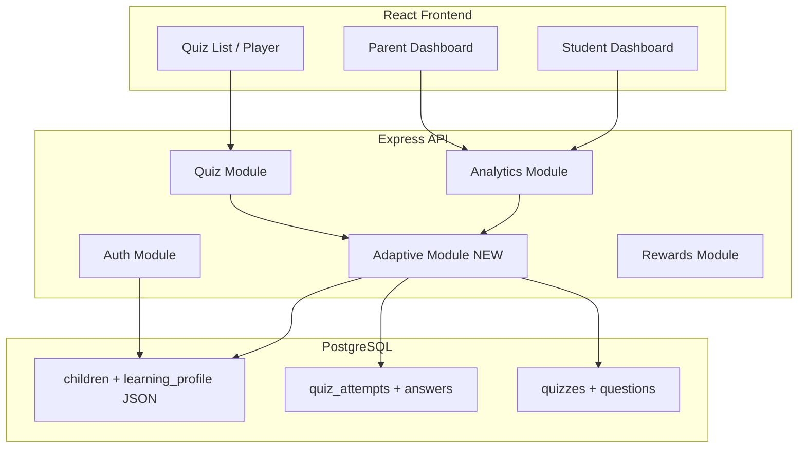
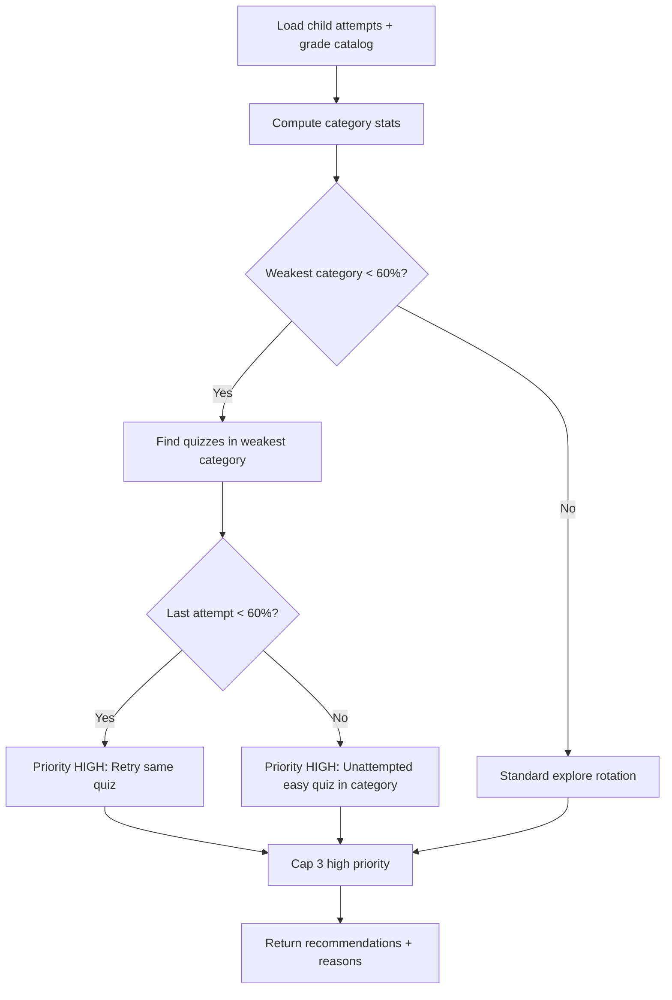
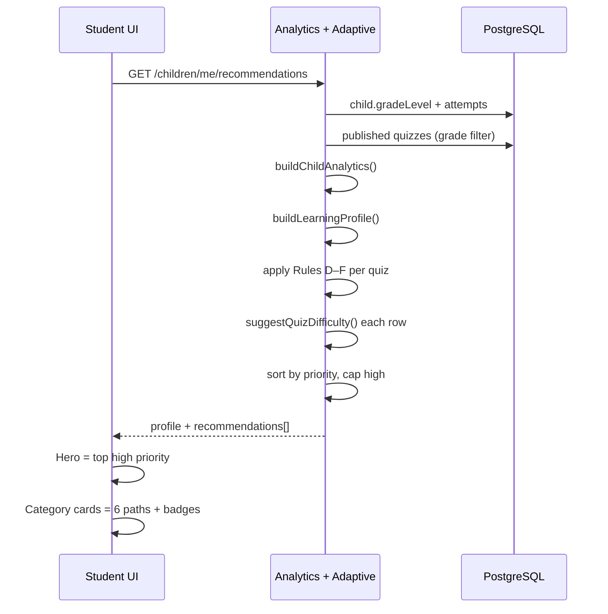

# Rule-Based Adaptive Learning Roadmap (Non-AI)

**Product scope:** Children **Pre-K through Grade 3**  
**Stack:** Node.js modular monolith, PostgreSQL (Prisma), React (Vite)  
**Explicitly excluded:** AI, ML, LLM, FastAPI, prediction models, mid-quiz question swapping

**Status vs codebase (May 2026):** Foundation exists (grades, categories, difficulty enums, analytics-on-read, grade-isolated catalog, basic recommendations). A full **Adaptive Engine** module is **not** wired end-to-end; `adaptiveDifficulty.service.js` exists but is **not** called from recommendations today.

---

## 1. Current system snapshot

| Module | Role today | Adaptive readiness |
|--------|------------|-------------------|
| Authentication | Parent + student JWT | Child id in token — good |
| Parent Dashboard | Multi-child analytics + recs | Per-child grade filter ✅ |
| Student Dashboard | Top picks, progress, rewards | Grade scope ✅; rules shallow |
| Grade-based Quiz System | 6 categories × grade catalog | Metadata ready (`category`, `difficultyLevel`, `topic`) |
| Analytics | Compute-on-read from attempts | Subject/category breakdown, learning speed |
| Recommendations | Priority + matchType rules | No difficulty orchestration wired |
| Rewards | XP, badges, streaks | Can gate badges on mastery rules later |

---

## 2. Target architecture



**Principle:** Adaptive decisions are **pure functions** over attempt history + catalog metadata. No background ML jobs in MVP.

---

## 3. Adaptive behavior rules (rule engine v1)

Constants (tunable in `adaptive.constants.js`):

| Constant | Value | Ages Pre-K–G3 note |
|----------|-------|---------------------|
| `WEAK_ACCURACY` | 60% | Remediation |
| `STRONG_ACCURACY` | 80% | Advancement |
| `MASTERY_ATTEMPTS` | 2 | Min completes before step-up |
| `ROLLING_WINDOW` | Last 5 attempts | Recent trend |
| `MAX_DAILY_HIGH_PRIORITY` | 3 | Avoid overwhelm |

### Rule set A — Access (hard gate)

| ID | If | Then |
|----|-----|------|
| A1 | `quiz.gradeLevel !== child.gradeLevel` | Exclude from catalog and recommendations |
| A2 | Quiz unpublished | Exclude |
| A3 | Child grade unknown | Empty catalog + friendly empty state |

*Already implemented via `gradeCatalogFilter.js`.*

### Rule set B — Difficulty suggestion (per quiz)

| ID | If | Then | `action` |
|----|-----|------|----------|
| B1 | Unattempted + overall ≥ 80% | Suggest `easy+1` (cap hard) | `step_up` |
| B2 | Last score < 60% | Suggest `easy` or −1 level | `step_down` |
| B3 | Attempts ≥ 2 + last ≥ 80% + rolling ≥ 80% | +1 difficulty | `step_up` |
| B4 | Rolling < 60% with prior attempts | Review easier | `review` |
| B5 | Default | Quiz default difficulty | `stay` |

*Logic exists in `adaptiveDifficulty.service.js` — wire into recommendations + attempt start.*

### Rule set C — Category mastery (per learning category)

| ID | If | Then |
|----|-----|------|
| C1 | Category accuracy < 60% (≥ 3 question attempts) | Mark category `needs_practice` |
| C2 | Category accuracy ≥ 80% (≥ 2 quizzes completed) | Mark `mastery` |
| C3 | No data | Mark `explore` |

Categories: math, science, pattern_recognition, memory, problem_solving, critical_thinking.

### Rule set D — Recommendation priority

| Priority | Conditions (first match wins) |
|----------|----------------------------|
| **high** | Weak category + (unattempted OR last score < 60%) |
| **medium** | Unattempted in non-weak category OR strong performer exploring |
| **low** | Maintain mastery / already strong |

### Rule set E — Strong subject advancement

| ID | If | Then |
|----|-----|------|
| E1 | Strongest category ≥ 80% AND weakest ≥ 20 pts lower | Surface 1 “challenge” quiz: same grade, `hard` or unattempted hard in strong category |
| E2 | All categories ≥ 80% | Badge + parent insight “ready for harder difficulty band” (still same grade) |

### Rule set F — Weak subject remediation

| ID | If | Then |
|----|-----|------|
| F1 | Weakest category < 60% | Recommend **same quiz retry** if last < 60%, else **easiest unattempted** in that category |
| F2 | Learning speed: `weak_concept` signal ≥ 2 in category | Add reason: “Take your time — practice shorter sessions” |
| F3 | Never recommend >3 high-priority items at once | Cap list after sort |

### Rule set G — Rewards coupling (optional MVP+)

| ID | If | Then |
|----|-----|------|
| G1 | Complete quiz after `step_down` with ≥ 70% | Bonus XP “Comeback Star” |
| G2 | Master all 6 categories at ≥ 80% | Badge “Grade Path Master” |

---

## 4. Student learning profile structure

**MVP:** Computed on read, cached in API response (no new table).  
**Phase 2:** Persist snapshot on `children.learning_profile` (JSON) updated after each completed attempt.

```typescript
// learning_profile (JSON on Child) — versioned schema v1
{
  "schemaVersion": 1,
  "updatedAt": "ISO-8601",
  "gradeLevel": "pre_k",
  "overall": {
    "completedQuizzes": 4,
    "averagePercent": 72,
    "rollingAveragePercent": 75,
    "lastActivityAt": "ISO-8601"
  },
  "byCategory": {
    "math": {
      "status": "needs_practice" | "explore" | "mastery",
      "averagePercent": 55,
      "attempts": 12,
      "completedQuizzes": 1,
      "lastScorePercent": 50,
      "suggestedDifficulty": "easy"
    }
    // ... 5 more categories
  },
  "difficultyState": {
    "currentBand": "easy" | "medium" | "hard",
    "recommendedBand": "medium",
    "trend": "improving" | "steady" | "declining"
  },
  "learningSpeed": { /* existing LearningSpeedInsights */ },
  "nextActions": [
    { "type": "retry", "quizId": 12, "category": "math", "priority": "high" },
    { "type": "explore", "quizId": 15, "category": "science", "priority": "medium" }
  ]
}
```

---

## 5. Difficulty progression logic

```text
Grade band (child.gradeLevel)     → which quizzes appear (exact match only)
Difficulty band (easy/med/hard)   → how hard questions feel within that grade
```

**Progression within same grade:**

1. Start at quiz default difficulty (catalog: Pre-K/K = easy, G1–G3 = easy/medium mix).
2. After each **completed** attempt, run `suggestQuizDifficulty()`.
3. Store `suggestedDifficulty` on recommendation rows and show on student hero (“Try Medium Math next”).
4. **Phase 2:** When starting attempt, set `quiz_attempts.difficulty_level_at_start` for audit.

**No cross-grade promotion in MVP** (no Grade 2 content for Grade 1 child).

---

## 6. Weak subject remediation logic



**Copy for kids (Pre-K–G3):** Short, encouraging; no percentages on Pre-K/K cards (use “Let’s practice counting again!”).

---

## 7. Strong subject advancement logic

1. Identify **strongest** category (avg ≥ 80%, min 2 quizzes).
2. If weakest is ≥ 20 points lower → one **challenge** slot:
   - Prefer unattempted quiz in strong category at `hard` (or medium if hard missing).
3. Do **not** deprioritize weak categories — advancement is **additive** (max 1 challenge pick in top 3 student picks).

---

## 8. Quiz recommendation flow



---

## 9. Database fields required

### MVP (minimal migration)

| Table | Field | Type | Purpose |
|-------|-------|------|---------|
| `quiz_attempts` | `difficulty_level_at_start` | `DifficultyLevel?` | Audit trail |
| `children` | `learning_profile` | `Json` | **Already exists** as `learning_preferences` — add profile key or rename usage |

**Recommendation:** Use `learning_preferences.adaptiveProfile` nested object to avoid migration, OR add `learning_profile Json` column in Phase 2.

### Phase 2 (optional normalization)

| Table | Purpose |
|-------|---------|
| `child_category_stats` | Cached per-category aggregates (refresh on attempt complete) |

**Not required for FYP MVP** if compute-on-read stays fast (&lt; 50 attempts per child).

---

## 10. API changes required

| Method | Path | Change |
|--------|------|--------|
| GET | `/api/children/me/recommendations` | Add `learningProfile`, `adaptiveSummary`, wire difficulty rules |
| GET | `/api/children/:id/recommendations` | Same bundle for parent |
| GET | `/api/children/:id/analytics` | Include `byCategory` using `quiz.category` not legacy subject |
| GET | `/api/quizzes` | Optional query `?category=math` for student |
| POST | `/api/attempts` (complete) | Trigger `refreshLearningProfile(childId)` async/sync |
| GET | `/api/children/:id/learning-profile` | **New** — dedicated profile for dashboards |

**Response additions (example):**

```json
{
  "learningProfile": { "byCategory": { "math": { "status": "needs_practice" } } },
  "recommendations": [{
    "quizId": 1,
    "priority": "high",
    "matchType": "weak_subject",
    "suggestedDifficulty": "easy",
    "adaptiveAction": "step_down",
    "reason": "Math needs practice — try counting again!"
  }]
}
```

---

## 11. UI changes required

| Screen | Change |
|--------|--------|
| Student Dashboard | Hero uses top recommendation **title + category icon**, not wrong grade text; show “Pre-K · Math · Easy” chips |
| Student Quiz List | Category cards show `needs_practice` / `mastery` badges from profile |
| Quiz Player | Pre-attempt banner: “Suggested level: Easy” (informational only) |
| Quiz Result | “What’s next?” single CTA from `nextActions[0]` |
| Parent Dashboard | Per-child “Focus area” = weakest **category**; “Strength” = strongest |
| Parent Reports | Category breakdown table (6 rows) |

**Pre-K–G3 UX:** Larger touch targets, minimal text, emoji category icons, no scary red scores.

---

## 12. FYP-friendly implementation plan

### Phase 0 — Document & align (1 week)

- Approve this roadmap as FYP “Adaptive Learning” chapter.
- Map rules to test cases in `scripts/verify-adaptive-rules.mjs`.

### Phase 1 — MVP Adaptive Module (2–3 weeks) ★ Recommended FYP deliverable

1. Create `backend/src/modules/adaptive/`:
   - `adaptive.constants.js`
   - `learningProfile.service.js` (compute profile from attempts)
   - `recommendationRules.service.js` (wrap + replace inline logic in analytics)
   - `adaptiveOrchestrator.service.js`
2. Wire `suggestQuizDifficulty()` into recommendation pipeline.
3. Switch weakest/strongest from `subject` → **`LearningCategory`**.
4. Extend API DTOs + frontend types.
5. Student UI: profile-driven badges on 6 category cards.
6. Tests: Pre-K child → only Pre-K recs; weak math → math quiz high priority.

**Deliverable demo:** Parent sets child Pre-K → student sees Pre-K paths → poor Memory score → Memory path highlighted.

### Phase 2 — Persist profile + attempt difficulty (1–2 weeks)

- Write `learning_profile` on attempt complete.
- Parent API: learning profile summary.
- Rolling window accuracy (last 5 attempts).

### Phase 3 — Content depth for adaptive (parallel / content team)

- Ensure each Pre-K–G3 cell has easy + medium variant OR multiple slugs per category (`pre_k-math-easy`, `pre_k-math-medium`) for true difficulty progression.

### Phase 4 — Polish (1 week)

- Rewards badges tied to mastery rules.
- Parent email-style insight strings (rule-generated templates).

---

## 13. Risks

| Risk | Impact | Mitigation |
|------|--------|------------|
| Wrong student login vs parent-selected child | Wrong grade content | JWT `/me` routes; UI “Learning as Ali (Pre-K)” |
| Too few attempts for rules | Noisy weak/strong | Default to `explore`; require min 3 question attempts for category status |
| One quiz per category | Retry-only remediation | Accept for MVP; Phase 3 add second quiz per category per difficulty |
| `learning_preferences` conflated with adaptive | Data confusion | Namespace `adaptiveProfile` key |
| Performance compute-on-read | Slow dashboard | Cache profile JSON; invalidate on attempt complete |
| Pre-K literacy | Text-heavy reasons | Template library by grade band |

---

## 14. Recommended MVP version (FYP)

**Include:**

- Grade isolation (done)
- 6-category learning profile (computed)
- Rule-based recommendations with `matchType`, `priority`, `adaptiveAction`, `suggestedDifficulty`
- Weak remediation + strong advancement (Rules F, E)
- Student top-3 picks + category badges
- Parent focus/strong category labels
- Verification script + architecture diagram in thesis

**Defer:**

- Separate FastAPI service
- ML / IRT / knowledge tracing
- Mid-quiz difficulty swap
- Cross-grade advancement
- Grades 4–6 in adaptive thesis narrative (mention as future scale)

---

## 15. File map (implementation)

| New / modified | Path |
|----------------|------|
| New module | `backend/src/modules/adaptive/*` |
| Wire | `analyticsOrchestrator.service.js` → adaptive orchestrator |
| Rules | `adaptiveDifficulty.service.js` (existing, move under adaptive/) |
| Spec | `backend/docs/specs/09-adaptive-engine.md` (to author in Phase 1) |
| Verify | `backend/scripts/verify-adaptive-rules.mjs` |
| FE | `frontend/src/api/adaptive.ts`, `useLearningProfile.ts` |

---

## 16. Alignment with existing docs

- [07-adaptive-content-foundation.md](./specs/07-adaptive-content-foundation.md) — schema ✅
- [08-adaptive-difficulty-rules.md](./specs/08-adaptive-difficulty-rules.md) — rules ✅ (wire-up pending)
- [CONTENT_COVERAGE_REPORT.md](./CONTENT_COVERAGE_REPORT.md) — 48 quizzes, Pre-K–G6
- [PRE_K_GRADE_ISOLATION_ROOT_CAUSE.md](./PRE_K_GRADE_ISOLATION_ROOT_CAUSE.md) — access rules ✅

**Thesis framing:** *“A rule-based adaptive engine using quiz metadata, attempt analytics, and explicit pedagogical thresholds — designed for early learners (Pre-K–Grade 3) without machine learning.”*
