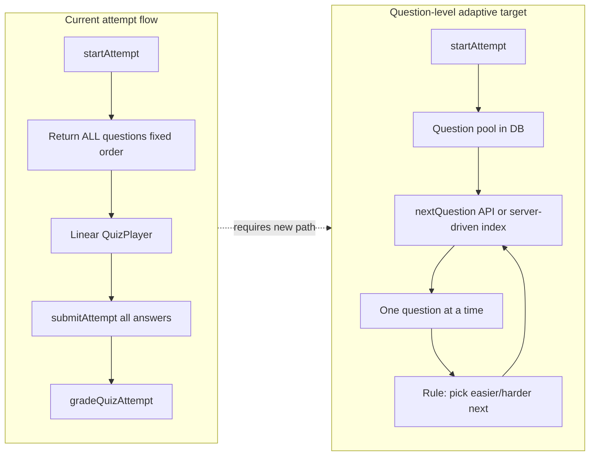
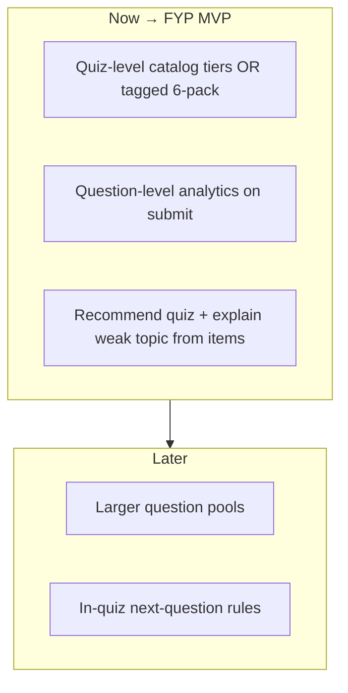

# Question-Level Adaptive Learning — Feasibility Report

**Project:** Adaptive Learning System (Pre-K to Grade 3 focus)  
**Date:** 2026-06-01  
**Scope:** Rule-based question-level adaptation **before** any AI/ML  
**Constraint:** Analysis only — no code changes in this deliverable

---

## Executive summary

| Question | Answer |
|----------|--------|
| Is question-level adaptive learning feasible? | **Yes, partially today** — schema and attempt telemetry support it; **in-quiz dynamic selection is not implemented**. |
| Recommended approach | **Hybrid:** quiz-level adaptation first (catalog + recommendations), then question-level **analytics and rules**, then optional **in-quiz question sequencing** once content pools exist. |
| Overall complexity | **Medium** for analytics + rules; **High** for real-time per-attempt question paths. |
| Biggest blocker | **Content:** each quiz is a single difficulty band with 6 homogeneous questions; no tagged easy/medium/hard item pool per category. |

---

## 1. Feasibility with current architecture

### 1.1 What “question-level adaptive” can mean (three levels)

| Level | Description | Feasible now? |
|-------|-------------|---------------|
| **L1 — Analytics** | After attempts, report accuracy/speed by `effectiveDifficulty`, `topic`, `skillArea` | **Yes** — data exists; aggregation helper exists but is **underused** in recommendations |
| **L2 — Rules on profile** | Recommend next **quiz** using question-level weak topics (e.g. “Addition” weak) | **Yes** — requires wiring `topic` / `skillArea` into analytics (not only legacy `subject`) |
| **L3 — In-quiz adaptation** | During an attempt, **select next question** from a pool by rules (easier if last wrong, etc.) | **No** — player + API deliver a **fixed ordered list** at `startAttempt`; all questions submitted at end |

### 1.2 Architectural fit

**Conclusion:** The **modular monolith** (Auth, Quiz, Analytics, Rewards) does **not** need replacement. Question-level adaptation is a **vertical extension** of the Quiz + Analytics modules, not a new stack. Spec `07-adaptive-content-foundation.md` explicitly deferred “real-time difficulty switching” — so feasibility is **technical yes**, **product not yet built**.

### 1.3 Pre-K to Grade 3 scope note

Published catalog for thesis scope: **8 grades × 6 categories = 48 quizzes**, **6 questions each** (~288 items). Grade isolation and category cards are implemented. Question-level rules are meaningful only if items are **tagged and pooled** beyond those 6 fixed slots.

---

## 2. Existing modules that can be reused

| Module / asset | Reuse for question-level |
|----------------|--------------------------|
| **Prisma schema** | `QuizQuestion.difficultyLevel`, `topic`, `skillArea`, `estimatedTimeSeconds`; `QuizAttemptAnswer.isCorrect`, `timeTakenSeconds`, `answeredAt` |
| **`effectiveDifficulty.js`** | Canonical `question.difficultyLevel ?? quiz.difficultyLevel` |
| **`adaptiveDifficulty.service.js`** | `aggregateByEffectiveDifficulty()`, `suggestQuizDifficulty()` (quiz-centric today) |
| **`learningSpeed.js`** | Per-answer timing signals (`weak_concept`, `quick_miss`, etc.) |
| **`quizScoring.service.js`** | Per-question grading already produces `isCorrect` + `timeTakenSeconds` |
| **`childAnalytics.service.js`** | Extend to group by `topic` / `skillArea` / effective difficulty |
| **`gradeCatalogFilter.js`** | Grade gate for any pool selection |
| **`recommendation.service.js`** | Extend `targetConcepts` to use question-derived weak topics |
| **`upsertCatalogQuiz.js`** | Already accepts per-question `difficultyLevel`, `skillArea`, `topic` |
| **Frontend `QuizPlayer`** | Timing per question already tracked; UI is linear — reuse for L3 with new “fetch next” contract |

**Not wired today:** `aggregateByEffectiveDifficulty` is **not** called from `recommendation.service.js` (concept profile uses quiz-level subject only). `suggestQuizDifficulty` is **not** invoked from recommendations.

---

## 3. Required changes by area

### 3.1 Quiz Engine

| Area | Current | Required for question-level |
|------|---------|----------------------------|
| `startAttempt` | Returns full `questions[]` | **L3:** Return subset + session state, or `GET /attempts/:id/next-question` |
| Attempt session | Only `in_progress` + quizId | **Session config:** target count (e.g. 8), difficulty cursor, served question ids |
| Submission | All questions required at once | **L3:** Incremental answer save OR final submit with variable count |
| Selection logic | None | **New service:** `questionSelection.service.js` (rule-based) |
| Ownership / grade | Grade check on quiz | Also validate each selected `questionId` belongs to allowed grade/category pool |

**Complexity:** **High** for L3; **Low** for L1–L2 (no engine change).

### 3.2 Question Model

| Field | Status | Action |
|-------|--------|--------|
| `difficultyLevel` | Optional override | **Populate in seed** for pool tiers (or separate quiz slugs per tier) |
| `topic` | Populated (string) | Standardize taxonomy per grade (align with curriculum blueprint) |
| `skillArea` | Optional, usually null | Default to `quiz.category` on seed if null |
| `estimatedTimeSeconds` | Defaults 45 on upsert | Tune by grade band (Pre-K: 60s, G3: 40s) |
| `orderIndex` | Fixed 0..n-1 | **L3:** `orderIndex` = pool sort key, not display order |

**Optional schema (Phase C+):**

- `question_pool_id` or `parent_quiz_id` — group items for one “learning path”
- `prerequisite_topic` — rule edges (defer to post-MVP)

### 3.3 Quiz Attempt Model

| Field | Status | Action |
|-------|--------|--------|
| `QuizAttemptAnswer` | Complete per item | **L3:** Allow partial attempts or require exactly `sessionQuestionCount` rows |
| `QuizAttempt` | No difficulty snapshot | Add `difficulty_level_at_start`, `adaptive_mode` (`fixed` \| `question_adaptive`), `question_plan` JSON |
| Scoring | 1 point per question | Keep; define pass % on **served** count not pool size |

### 3.4 Analytics

| Area | Current | Required |
|------|---------|----------|
| Subject breakdown | Quiz-level `resolveQuizSubject` | Add **`byTopic`**, **`byCategory`**, **`byEffectiveDifficulty`** |
| Concept profile | Topic = subject label from quiz | Build from **answer rows** + `question.topic` |
| Learning speed | Uses `subjectLabel` per answer | Pass **`topic`** or **category** per answer |
| Parent reports | Subject performance | Add topic drill-down (e.g. “Addition within 20”) |

**Complexity:** **Medium** — mostly compute-on-read refactors.

### 3.5 Recommendations

| Area | Current | Required |
|------|---------|----------|
| Unit of recommendation | Whole **quiz** | Still quiz for MVP; **reason text** cites weak **topics** from question analytics |
| Priority rules | weak_subject at quiz level | **high** if topic accuracy &lt; 60% with ≥ 3 answers |
| Difficulty | `quiz.difficultyLevel` only | Use **mode difficulty** of next quiz + “start with easy items” copy |
| Advanced | N/A | Optional: recommend **session** on a pool quiz (same slug, adaptive flag) |

**Complexity:** **Medium** when staying quiz-level delivery; **High** if recommending dynamic sessions.

---

## 4. Content prerequisites

### 4.1 Easy / Medium / Hard questions

**Current seed reality:**

- One **quiz-level** `difficultyLevel` per slug (`buildQuiz()` in `catalog/utils.js`: Pre-K/K → `easy`, G1–G3 mostly `easy`/`medium`).
- **All 6 questions** in a quiz inherit that band; **`question.difficultyLevel` is null** in catalog files (e.g. `grade_1.js`).

**Blueprint rule** ([CURRICULUM_BLUEPRINT.md](./curriculum/CURRICULUM_BLUEPRINT.md)):

> Prefer **one quiz per topic per difficulty tier** rather than mixing Easy/Medium/Hard in a single quiz.

**Two viable content strategies:**

| Strategy | Content shape | Best for |
|----------|---------------|----------|
| **A — Multi-quiz per tier** | `grade_1-math-easy`, `grade_1-math-medium`, `grade_1-math-hard` (3× catalog) | Quiz-level + simple player (no L3 engine change) |
| **B — Single pool quiz** | One slug with 15–20 questions tagged easy/med/hard; serve 6–8 per attempt | True in-quiz question-level (L3) |

**For Pre-K–G3 hybrid MVP:** Start with **Strategy A** (3 quiz difficulties × 6 categories × 8 grades = 144 quizzes max — heavy). **Pragmatic MVP:** 2 tiers only (**easy + medium**) for **Grade 1–3** first (36 extra quizzes) or tag **2 easy + 2 medium + 2 hard** inside existing 6-question quizzes (Strategy B light).

### 4.2 Minimum content for rule-based question adaptation

| Grade band | Easy items | Medium | Hard | Notes |
|------------|------------|--------|------|-------|
| Pre-K / K | 5+ per category | 3+ | 0–2 | Hard optional; avoid frustration |
| Grade 1–3 | 5+ | 5+ | 3+ | Need hard for “step up” within session |

Without **at least two difficulty bands** of items in the same category+grade, rules can only **switch quizzes**, not **questions**.

---

## 5. How many questions per category (recommended)

**Thesis scope (Pre-K – Grade 3):** 6 learning categories × 8 grades.

### 5.1 Current (baseline)

| Metric | Value |
|--------|-------|
| Quizzes per grade | 6 (1 per category) |
| Questions per quiz | 6 (fixed) |
| Questions per category per grade | **6** |
| Total items (P–G3) | **288** |

Sufficient for **quiz-level** adaptation and static play; **insufficient** for rich **in-quiz** question-level paths.

### 5.2 Recommended targets

| Model | Questions per category per grade | Total (8 grades × 6 cat) |
|-------|----------------------------------|---------------------------|
| **Minimum viable (analytics only)** | 6 (current) + `topic` + per-question difficulty tags on 2–3 items | 288 (retag only) |
| **Quiz-tier model (Strategy A)** | 6 per tier × 2 tiers = **12** (easy+medium) | **576** |
| **Pool model (Strategy B)** | **18** in pool, **8** served per session | **864** in DB |

**Practical FYP recommendation:**

- **Phase A:** Retag existing 6 questions: 2 easy + 2 medium + 2 hard per quiz (same stem complexity ladder).
- **Phase B:** Expand to **10–12** questions per category per grade (add 4–6 new items via seed).
- **Phase C (optional):** **18** question pool, **8** per session for Grade 1–3 pilots only.

### 5.3 Session length (child UX)

| Age | Questions per session | Time |
|-----|----------------------|------|
| Pre-K / K | 5–6 | 5–8 min |
| Grade 1–3 | 6–8 | 8–12 min |

---

## 6. Data to collect for future AI training

You already persist most **tabular** features needed for supervised learning later. **Do not** block question-level rules on AI.

### 6.1 Already collected (keep quality high)

| Entity | Fields | AI use later |
|--------|--------|--------------|
| `QuizAttemptAnswer` | `isCorrect`, `timeTakenSeconds`, `answeredAt`, `questionId`, `selectedOptionId` | Labels + timing |
| `QuizQuestion` | `topic`, `difficultyLevel`, `skillArea`, `orderIndex` | Features |
| `Quiz` | `category`, `gradeLevel`, `difficultyLevel` | Context |
| `Child` | `gradeLevel`, `age`, `learningPreferences` | Cohort features |
| Derived | Learning speed signals | Engagement |

### 6.2 Recommended additions (AI readiness, rule-friendly now)

| Field | Where | Purpose |
|-------|-------|---------|
| `difficulty_level_at_attempt` | `QuizAttempt` | Label what band was assigned |
| `effective_difficulty` (denormalized) | `QuizAttemptAnswer` snapshot at grade time | Avoid retroactive taxonomy drift |
| `question_display_order` | Attempt metadata JSON | Sequence models |
| `rule_action` | Attempt metadata (`step_down`, etc.) | Policy learning |
| `distractor_index` / option ids | Already have option id | Error analysis |
| Session `abandoned_at_question` | Attempt status + index | Dropout models |
| **No PII** in exports | Export pipeline | Ethics / FYP compliance |

### 6.3 Export schema (future)

One row per **question presentation event**:

`child_id, grade, category, topic, effective_difficulty, is_correct, time_seconds, quiz_id, question_id, attempt_id, timestamp, adaptive_action`

Store exports as Parquet/CSV monthly — **no ML pipeline required** for FYP.

---

## 7. Implementation phases

### Phase A — Question difficulty structure

**Goal:** Honest metadata for every item.

| Task | Output |
|------|--------|
| Tag each seeded question with `difficultyLevel` OR split slugs by tier | DB + seed updated |
| Set `skillArea` = quiz `category` where null | Consistent analytics |
| Normalize `topic` strings per grade/category | Weak-topic rules |
| Document pool vs quiz-tier choice for P–G3 | Content plan |
| Audit script: % questions with null difficulty | CI gate |

**Complexity:** **Medium** (content + seed, not engine)  
**Depends on:** Nothing  
**Blocks:** Phase B rules

---

### Phase B — Question-level adaptive rules (post-hoc + next-quiz)

**Goal:** Rule engine uses **answer history** at topic/difficulty granularity; recommendations cite weak topics.

| Task | Output |
|------|--------|
| `buildQuestionAnalytics(attempts)` — by topic, effectiveDifficulty, category | Service |
| Wire `aggregateByEffectiveDifficulty` into concept profile | API DTO |
| Rules: if last 3 easy wrong → recommend easy-tier quiz; if medium mastery → hard tier | Documented rule table |
| Extend recommendation `reason` with topic strings | Parent/student copy |
| `verify-question-adaptive-rules.mjs` | Test script |

**Still fixed-order quiz play** — no `nextQuestion` API.

**Complexity:** **Medium**

---

### Phase C — Student learning profile

**Goal:** Single profile object for dashboards (see [ADAPTIVE_LEARNING_ROADMAP.md](./ADAPTIVE_LEARNING_ROADMAP.md)).

| Task | Output |
|------|--------|
| `learningProfile` with `byCategory`, `byTopic`, `byDifficultyBand` | JSON on read / persist on complete |
| Student UI: weak topic chips on category cards | FE |
| Parent: “Focus: Addition (58%)” | FE |

**Complexity:** **Medium**

---

### Phase D — AI readiness (no AI in production)

| Task | Output |
|------|--------|
| Export job + schema doc | `docs/AI_TRAINING_DATASET.md` |
| Anonymization policy | FYP ethics section |
| Feature dictionary | For future work |

**Complexity:** **Low**

---

### Phase E (optional, post-FYP) — In-quiz question selection

| Task | Output |
|------|--------|
| Question pool + `AdaptiveAttemptSession` | Schema |
| `POST .../next-question` | API |
| QuizPlayer state machine | FE |
| Rule: wrong → easier topic; 3 correct → harder | Engine |

**Complexity:** **High**

---

## 8. Risks and limitations

| Risk | Severity | Mitigation |
|------|----------|------------|
| **Thin pools** (6 Q, one difficulty) | High | Phase A tagging or tier quizzes |
| **Attempt integrity** (client submits all ids) | Medium | Server-side session tracks served ids only |
| **Pre-K reading load** | Medium | Short stems; audio later |
| **Confounding grade vs difficulty** | Medium | Never cross grade; difficulty only within grade |
| **Rule instability** (3 answers) | Medium | Min sample sizes before `needs_practice` |
| **Scope creep to L3** | High | Ship B+C before E |
| **Blueprint vs mixed quiz** | Low | Document chosen strategy in thesis |
| **GDPR / child data** | Medium | Export anonymized ids only |

**Hard limitations (non-AI):**

- No automatic **item generation** — all rules need human-authored questions.
- No **knowledge tracing** (BKT/IRT) without calibration data and psychometric work.
- **One correct MCQ** format only — adaptation is selection, not generation.

---

## 9. Estimated complexity

| Work package | Complexity | Rationale |
|--------------|------------|-----------|
| Phase A content structure | **Medium** | 288–800+ items to tag/write |
| Phase B analytics + rules | **Medium** | Refactor analytics; no player change |
| Phase C learning profile | **Medium** | DTO + UI |
| Phase D export / AI readiness | **Low** | Documentation + script |
| Phase E in-quiz adaptive | **High** | API, session state, FE, QA |
| **Overall FYP (A+B+C+D, quiz delivery)** | **Medium** | Fits one semester with existing modules |
| **Full question-level in-quiz (A–E)** | **High** | Second semester or reduced grade scope |

---

## 10. Quiz-level vs question-level vs hybrid

### Option 1 — Quiz-level only

- Recommend **which quiz** (easy/medium/hard slug) from category+grade.
- Player unchanged.
- **Pros:** Fastest; matches current 48-quiz grid; blueprint-aligned if 2–3 slugs per category.
- **Cons:** Coarse; all 6 questions same band; weak topic nuance only in copy.

### Option 2 — Question-level only (in-quiz)

- Pool of tagged questions; dynamic session.
- **Pros:** True “adaptive” feel; finer remediation.
- **Cons:** **High** engineering; **3× content** minimum; harder FYP demo stability.

### Option 3 — Hybrid (recommended)

| Layer | What adapts | When |
|-------|-------------|------|
| **Quiz-level** | Which published quiz / difficulty slug | Before session (recommendations) |
| **Question-level (analytics)** | Topic/difficulty mastery profile | After each attempt |
| **Question-level (delivery)** | Which question is next | During session (Phase E) |

**Recommendation for Pre-K–Grade 3 FYP:**

1. Implement **hybrid Phase A+B+C** with **quiz-level delivery**.
2. Tag questions inside existing quizzes (2E/2M/2H) so analytics are question-level even if delivery is not.
3. Add **easy + medium** quiz variants for **Grade 1–3** only if content bandwidth allows (36–72 extra quizzes).
4. Defer **in-quiz** selection to post-FYP unless core scope is only Grades 1–2 with one category pilot pool.

---

## Appendix A — Current vs required API surface

| API | Question-level L1–L2 | L3 in-quiz |
|-----|---------------------|------------|
| `GET /quizzes` | No change | Optional `adaptive=true` flag |
| `POST /attempts/start` | No change | Returns plan + first question only |
| `POST /attempts/:id/answer` | N/A | New incremental |
| `GET /attempts/:id/next-question` | N/A | New |
| `POST /attempts/:id/submit` | No change | Validates served set |
| `GET /children/me/recommendations` | Enriched reasons | Same |

---

## Appendix B — Code references (audit)

| Path | Relevance |
|------|-----------|
| `backend/prisma/schema.prisma` | Question + answer models |
| `backend/src/shared/content/effectiveDifficulty.js` | Effective difficulty |
| `backend/src/modules/adaptive/adaptiveDifficulty.service.js` | Aggregation + quiz suggest |
| `backend/src/modules/quiz/services/quizAttempt.service.js` | Fixed full-quiz flow |
| `backend/src/modules/analytics/services/recommendation.service.js` | Quiz-level recs |
| `backend/prisma/quiz/upsertQuiz.js` | Per-question metadata on seed |
| `frontend/src/pages/student/QuizPlayer.tsx` | Linear player + per-Q timing |
| `backend/docs/specs/07-adaptive-content-foundation.md` | Deferred real-time switching |
| `backend/docs/specs/08-adaptive-difficulty-rules.md` | Quiz-level rules spec |

---

## Final recommendation

**Feasible:** Yes — start with **question-level data and rules** on top of **quiz-level delivery** (hybrid).  

**Not feasible without content work:** True **in-quiz** question-level adaptation on the current **6-question single-band** catalog alone.

**FYP sweet spot:** Phase **A + B + C + D** = *“Rule-based adaptive system using question-level performance signals to drive quiz recommendations and learning profiles for Pre-K–Grade 3.”* Phase **E** is a strong **future work** chapter, not a blocker for claiming question-level **measurement** and **adaptation policy** at the pathway level.
