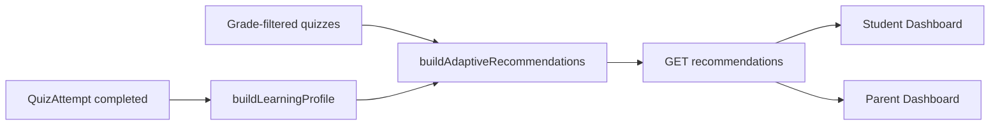

# Quiz-Wise Adaptive Learning MVP

Rule-based adaptive learning for **Pre-K through Grade 3** only. No AI, ML, question-level routing, or cross-grade recommendations.

---

## 1. Architecture impact report

### Current state

- **Recommendations:** `recommendation.service.js` uses legacy **subject** breakdown (math/science/logic) with thresholds 60/70/80.
- **Difficulty:** `adaptiveDifficulty.service.js` exists but is **not wired** into recommendations.
- **Grade isolation:** `gradeCatalogFilter.js` already restricts student/parent recommendation quiz lists to the child’s exact grade.
- **Catalog:** One published quiz per **grade × category** (slug `{grade}-{category}-{difficulty}`); difficulty is grade-default (Pre-K–G1 easy, G2–G4 medium, G5–G6 hard).

### MVP additions

| Layer | Change |
|--------|--------|
| **Adaptive module** | `learningProfile.service.js` — aggregate completed attempts by **6 learning categories**. |
| **Adaptive module** | `adaptiveRecommendations.service.js` — category status, difficulty band, adaptive actions, priority sorting. |
| **Analytics** | `recommendation.service.js` delegates to adaptive builder when `child.gradeLevel` ∈ Pre-K…G3. |
| **Orchestrator** | Response bundles include `learningProfile` + `adaptiveInsights` (focus, strongest, what’s next). |
| **Frontend** | Student/Parent dashboards read `adaptiveInsights` / `learningProfile` (not legacy subject-only chips for adaptive grades). |

### Data flow



### Out of scope (unchanged)

- Question-level routing, FastAPI, ML/LLM, Grades 4–6 adaptive rules (legacy recommendations remain).

---

## 2. Database impact report

### Schema changes

**None required for MVP.**

### Existing tables used

| Table | Usage |
|--------|--------|
| `QuizAttempt` | `status`, `percentage`, `score`, `totalPoints`, `quizId`, `childId` |
| `Quiz` | `category`, `gradeLevel`, `difficultyLevel`, `isPublished` |
| `Child` | `gradeLevel` for scope and adaptive eligibility |

### Computed at runtime (not persisted)

- Per-category average %, status (`needs_practice` / `progressing` / `mastery` / `unattempted`)
- Recommended difficulty band (easy / medium / hard)
- Adaptive action per quiz (`retry` / `practice` / `challenge`)
- `adaptiveInsights` snapshot for dashboards

### Optional future migration (not in MVP)

- `ChildCategoryProfile` table for caching — deferred.

### Content note

With **one quiz per category per grade**, “recommend Easy/Medium/Hard” maps to the **category status band** and the quiz’s stored `difficultyLevel` (grade-default). True multi-tier pick within a category would require additional catalog rows per difficulty.

---

## 3. API changes

### Endpoints (unchanged paths)

| Method | Path | Change |
|--------|------|--------|
| `GET` | `/api/children/:childId/recommendations` | Response adds `learningProfile`, `adaptiveInsights`; recommendation items add `category`, `categoryStatus`, `adaptiveAction`, `recommendedDifficulty`. |
| `GET` | `/api/children/me/recommendations` | Same (student JWT). |
| `GET` | `/api/children/recommendations/overview` | Each child object includes new fields. |

### New response shapes (additive)

**`learningProfile`**

```json
{
  "adaptiveEnabled": true,
  "categories": [
    {
      "category": "math",
      "label": "Math",
      "averagePercent": 85,
      "attemptCount": 2,
      "status": "mastery",
      "recommendedDifficulty": "hard"
    }
  ],
  "weakest": { "category": "memory", "label": "Memory", "averagePercent": 45, "status": "needs_practice" },
  "strongest": { "category": "pattern_recognition", "label": "Pattern Recognition", "averagePercent": 90, "status": "mastery" }
}
```

**`adaptiveInsights`**

```json
{
  "focusArea": { "category": "memory", "label": "Memory", "averagePercent": 45, "status": "needs_practice" },
  "strongestArea": { "category": "pattern_recognition", "label": "Pattern Recognition", "averagePercent": 90, "status": "mastery" },
  "whatsNext": {
    "quizId": 12,
    "title": "Grade 2 Memory",
    "category": "memory",
    "label": "Memory",
    "reason": "Memory needs practice — retry to improve.",
    "adaptiveAction": "practice",
    "priority": "high",
    "recommendedDifficulty": "easy"
  }
}
```

### Recommendation item additions

- `category`, `categoryLabel`, `categoryStatus`, `adaptiveAction`, `recommendedDifficulty` (string: easy | medium | hard)
- `matchType` may include `retry`, `practice`, `challenge` for adaptive grades

### Backward compatibility

- `subjectProfile` and `conceptProfile` retained for parent charts and legacy clients.

---

## 4. Files modified (planned)

### Backend (new)

- `backend/src/modules/adaptive/adaptiveRules.js`
- `backend/src/modules/adaptive/learningProfile.service.js`
- `backend/src/modules/adaptive/adaptiveRecommendations.service.js`
- `backend/scripts/verify-adaptive-mvp.mjs`
- `backend/docs/QUIZ_WISE_ADAPTIVE_MVP.md` (this file)

### Backend (updated)

- `backend/src/modules/analytics/services/recommendation.service.js`
- `backend/src/modules/analytics/services/analyticsOrchestrator.service.js`
- `backend/package.json` (verify script)
- `backend/scripts/verify-analytics-module.mjs` (assert new fields when adaptive grade)

### Frontend (updated)

- `frontend/src/api/recommendations.ts`
- `frontend/src/pages/student/StudentDashboard.tsx`
- `frontend/src/pages/parent/ParentDashboard.tsx`
- `frontend/src/components/features/student/StudentTopQuizPicks.tsx` (optional badges)

---

## 5. Verification checklist

- [x] `npm run verify:adaptive-mvp` passes (Pre-K–G3 profile + insights + grade isolation)
- [ ] `npm run verify:grade-isolation` still passes
- [x] `npm run verify:analytics-module` passes with adaptive field checks
- [ ] Student `GET /children/me/recommendations` returns `learningProfile.adaptiveEnabled: true` for G1–G3 / Pre-K / K
- [ ] Grade 4+ child returns `adaptiveEnabled: false` and legacy-style recommendations
- [ ] No recommendation `gradeLevel` differs from child grade
- [ ] Weakest category = lowest attempted average; strongest = highest
- [ ] Priority: high for `needs_practice`, medium for unattempted, low for mastery
- [ ] Student dashboard: Focus Area, Strongest Area, What’s Next
- [ ] Parent dashboard: Weakest Category, Strongest Category, Suggested Next Activity
- [ ] Frontend production build succeeds

---

## 6. Test scenarios

| # | Scenario | Setup | Expected |
|---|----------|--------|----------|
| 1 | Cold start (no attempts) | Pre-K child, zero completions | All categories `unattempted`; What’s Next = first high/medium unattempted quiz; focus/strongest null or balanced |
| 2 | Weak category | G2 child, memory attempts avg 45% | Memory `needs_practice`, priority high, action `practice`, recommended difficulty `easy` |
| 3 | Last quiz fail | G1 child, last math quiz 50% | Math recommendation action `retry`, priority high |
| 4 | Mastery challenge | G3 child, science avg 88% | Science `mastery`, action `challenge`, priority low, recommended `hard` |
| 5 | Progressing band | K child, problem_solving avg 70% | Status `progressing`, recommended `medium` |
| 6 | Grade isolation | Pre-K student JWT | Only `pre_k` quizzes in recommendations |
| 7 | G5 out of adaptive | Grade 5 child | `adaptiveEnabled: false`, legacy subject recommendations |
| 8 | Parent overview | Two children different grades | Each bundle grade-scoped with correct insights |
| 9 | Student vs parent | Same child id | Identical `learningProfile` / top recommendation |
| 10 | Cross-grade blocked | Parent selects Pre-K child | No `grade_2` quiz ids in list |

---

## Rule reference (implementation source of truth)

| Rule | Threshold / behavior |
|------|----------------------|
| Needs Practice | average &lt; 60% |
| Progressing | 60% – 79% |
| Mastery | ≥ 80% |
| Recommend difficulty | needs_practice → easy; progressing → medium; mastery → hard |
| retry | last quiz score &lt; 60% |
| practice | category average &lt; 60% |
| challenge | category average ≥ 80% |
| Priority high | weak category (`needs_practice`) |
| Priority medium | unattempted category |
| Priority low | mastery category |
