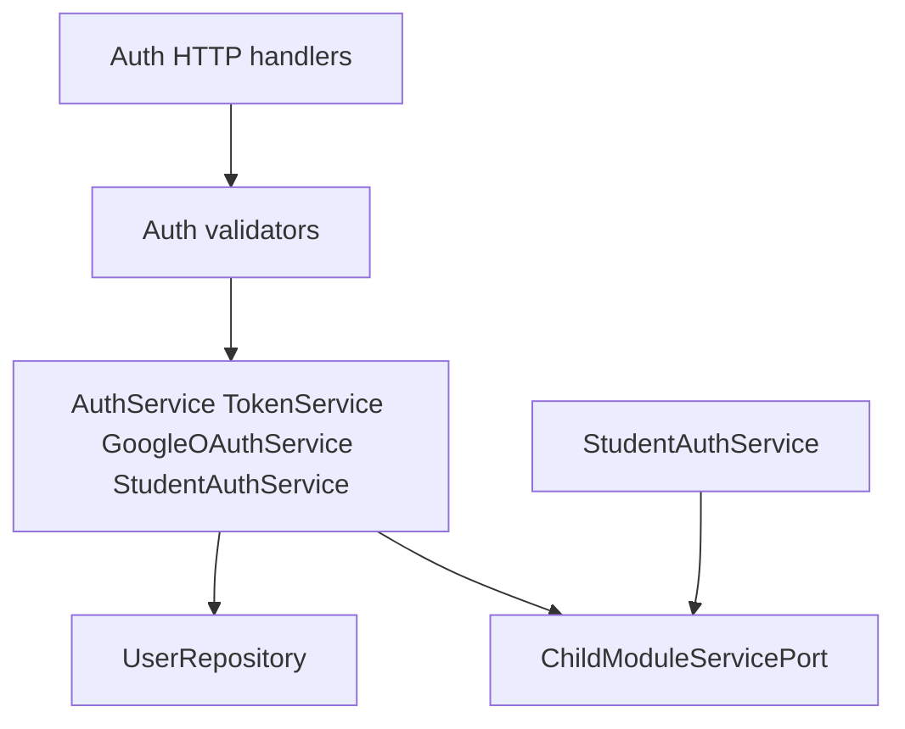
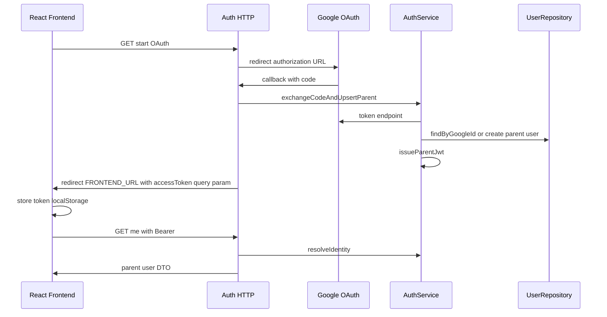
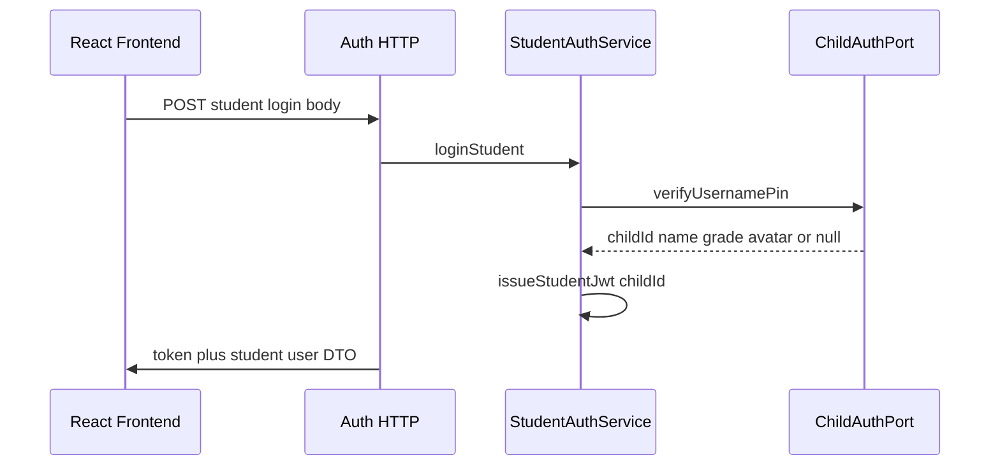
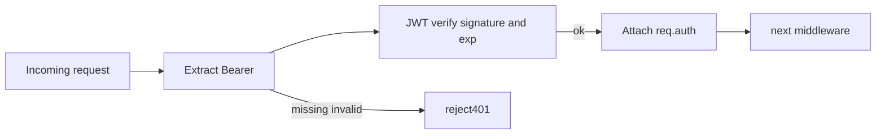

# Implementation Specification: Auth Module

**Version:** 1.0  
**Status:** Ready for review — no application code  
**Depends on:** Shared kernel (config, HTTP envelope, DB pool, base middleware)  
**Depended on by:** Parent, Child, Quiz, Analytics modules  

---

## 0. Shared kernel prerequisites (implement before Auth)

Auth module mounts on shared infrastructure defined once for the monolith:

| Component | Responsibility |
|-----------|----------------|
| Config loader | Validate `JWT_SECRET`, `JWT_EXPIRES_IN`, `DATABASE_URL`, Google OAuth vars, `FRONTEND_URL` at boot |
| Response helpers | `sendSuccess(res, data, message)`, `sendError(res, status, message, code?, errors?)` |
| `asyncHandler` | Wrap HTTP handlers; forward errors to error middleware |
| `AppError` hierarchy | `ValidationError` 422, `AuthError` 401/403, generic 500 |
| DB pool | Single PostgreSQL pool; modules receive pool via factory |
| Error middleware | Map `AppError` → envelope; hide stack in production |
| Axios-compat note | Document that FE will unwrap `success` + `data` in [client.ts](../../../frontend/src/api/client.ts) |

Auth owns **contract** for `req.auth` shape; shared kernel hosts the middleware implementation file.

---

## 1. Module responsibilities

### Owns

- Parent identity via **Google OAuth 2.0** (primary production path)
- **JWT access token** issuance, verification, and claims structure
- **Session identity** resolution (`who is calling?`) for downstream modules
- **Student credential verification** (username + PIN) against child records — verification only; child aggregate owned by Child module
- **Admin role** token shape and authorization hooks (no admin UI in Phase 1)
- Transitional **email/password** parent register/login for existing frontend compatibility (dev/FYP fallback only; not primary UX)

### Does not own

- Parent onboarding preferences, notification toggles, learning goals → **Parent module**
- Child profile CRUD, username assignment, PIN storage → **Child module** (Auth reads PIN hash via Child service contract for student login)
- Quiz, analytics, rewards data
- Google account linking for children (**forbidden** — enforced in validators and OAuth callback handler)

### Public surface (other modules may call)

| Export | Consumer | Purpose |
|--------|----------|---------|
| `authenticate` middleware | All protected routes | Parse JWT, attach `req.auth` |
| `authorize(...roles)` middleware | Route groups | Role gate |
| `AuthService.verifyStudentCredentials` | Auth HTTP only | Internal |
| `AuthService.issueTokenForParent` | OAuth callback | Internal |
| `AuthService.getIdentity(userId)` | Parent module | Resolve parent id from token subject |
| `OwnershipGuard.assertParentRole` | Child, Quiz | Confirm caller is parent |

Child module must **not** import Auth repositories.

---

## 2. Internal flow (layered)



| Layer | Responsibility |
|-------|----------------|
| HTTP handlers | Map request/response; no `if` business branches beyond HTTP status selection |
| Validators | Schema for body/query; reject before service |
| Services | OAuth exchange, user upsert, password verify, PIN verify orchestration, token mint |
| Repositories | `users` table CRUD for parent/admin identity |
| Ports | `ChildAuthPort.verifyUsernamePin(username, pin)` — interface Child module implements |

---

## 3. Auth lifecycle

### 3.1 Parent — Google OAuth (primary)



**Rules**

- Callback creates or updates parent user keyed by `google_id` (stable provider subject).
- Email from Google stored for display; uniqueness enforced per email when no `google_id` collision logic applies.
- **Reject** OAuth profile if provider signals child/minor-only account patterns are out of scope — only standard Google user accounts for parents.
- Never attach Google identity to `children` table.

### 3.2 Parent — email/password (compatibility / dev)

Used by existing [ParentAuth.tsx](../../../frontend/src/pages/auth/ParentAuth.tsx) until Google button is added.

| Step | Action |
|------|--------|
| Register | Create `users` row: `role=parent`, `password_hash`, normalized email |
| Login | Verify bcrypt; issue same JWT shape as Google path |
| Post-login | Same `me` and downstream behavior |

**Constraint:** Same JWT claims for Google and email parents so middleware is unified.

### 3.3 Student — username + PIN (Phase 1 Auth slice)



- Auth **does not** hash or store PIN; Child module owns hash.
- Student JWT `sub` may be stringified `childId` with `role=student` for FE `mapApiUser`.

### 3.4 Admin (readiness)

- Seed one `users` row with `role=admin` (implementation phase).
- `POST` admin login (internal/FYP tooling) issues JWT with `role=admin`.
- No frontend consumer in Phase 1.

### 3.5 Token verification (every protected request)



---

## 4. Middleware requirements

### 4.1 `authenticate` (shared kernel mount, Auth-owned contract)

| Input | Behavior |
|-------|----------|
| `Authorization: Bearer <token>` | Required on protected routes |
| Valid token | Set `req.auth = { userId, role, parentId?, childId?, email? }` |
| Missing/invalid/expired | `401` envelope, code `AUTH_UNAUTHORIZED` |

**Note:** `userId` for parent = `users.id`; for student = child id in `childId` claim (document in implementation; FE expects student `id` in user object).

### 4.2 `authorize(...allowedRoles)`

| Condition | Response |
|-----------|----------|
| `req.auth.role` not in allowed list | `403`, code `AUTH_FORBIDDEN` |
| Admin role | May bypass or explicit `authorize('admin')` only routes |

### 4.3 `optionalAuthenticate`

For routes that behave differently when logged in but allow anonymous access (none in Auth Phase 1; reserved).

### 4.4 Rate limiting (Auth routes only)

- Apply stricter limiter on: OAuth callback, login, register, student login.
- Suggested: 10 req / 15 min / IP per endpoint class (configure at implementation).

---

## 5. Validation requirements

| Operation | Rules |
|-----------|-------|
| Register (parent) | `name` non-empty; `email` valid format; `password` min 8; `role` must be `parent` |
| Login (parent) | `email`, `password` required |
| Profile update (name) | `name` trim, 1–255 chars — **may delegate to Parent service**; Auth handler can proxy |
| Student login | `username` 3–32 alphanumeric/underscore; `pin` 4–6 digits |
| Google callback | State param CSRF check; code required |
| OAuth start | Optional `returnUrl` whitelist against `FRONTEND_URL` origins |

**Policy validators (service-level)**

- `role=student` token cannot call parent-only routes.
- `role=parent` cannot call student-only routes unless explicitly allowed (quiz play uses parent token + child_id — Quiz module validates ownership).
- OAuth callback must not create `role=student` users.

---

## 6. Service boundaries

### `TokenService`

| Method | Responsibility |
|--------|----------------|
| `signAccessToken(payload)` | HS256 with `JWT_SECRET`, exp from `JWT_EXPIRES_IN` |
| `verifyAccessToken(token)` | Returns claims or throws `AuthError` |
| `buildParentClaims(user)` | `{ sub, role: parent, parentId: sub, email }` |
| `buildStudentClaims(child)` | `{ sub: childId, role: student, childId }` |
| `buildAdminClaims(user)` | `{ sub, role: admin }` |

**Token lifecycle (Phase 1)**

- Access token only; no refresh token.
- Logout = client discards token (no server revoke list for FYP).
- Phase 2: refresh token table optional.

### `GoogleOAuthService`

| Method | Responsibility |
|--------|----------------|
| `getAuthorizationUrl(state)` | Build Google consent URL |
| `exchangeCode(code)` | Return profile: `googleId`, `email`, `name`, `picture` |
| `validateState(state)` | CSRF |

### `AuthService` (parent identity)

| Method | Responsibility |
|--------|----------------|
| `registerParent(dto)` | Hash password, create user |
| `loginParent(dto)` | Verify password, return user + token |
| `upsertParentFromGoogle(profile)` | Link google_id, return user |
| `getCurrentUser(userId)` | Load parent for `me` |
| `updateParentName(userId, name)` | Update display name — or invoke ParentService |

### `StudentAuthService`

| Method | Responsibility |
|--------|----------------|
| `loginStudent(dto)` | Call ChildAuthPort; issue token; map student DTO for FE |

### `ChildAuthPort` (interface — implemented by Child module)

```
verifyUsernamePin(username, pin) -> { childId, name, gradeLevel, avatarUrl, parentId } | null
```

Auth module depends on **port**, not Child repository.

---

## 7. Repository responsibilities

### `UserRepository` (Auth-owned persistence)

| Operation | Entity |
|-----------|--------|
| `findById` | Parent/admin user |
| `findByEmail` | Login/register |
| `findByGoogleId` | OAuth upsert |
| `createParent` | Insert with role parent |
| `updateParentProfile` | Name, avatar_url (if stored on user) |
| `existsByEmail` | Register uniqueness |

**Conceptual `users` fields (migration described in §14, not DDL here)**

- `id`, `role` (`parent` | `admin`), `email`, `name`, `password_hash` nullable, `google_id` nullable unique, `avatar_url` nullable, `created_at`

**Explicit exclusion:** No `children` columns on `users`.

---

## 8. HTTP surface (contracts)

Base path: `/api/auth`  
All success responses use global envelope (see §10).

### 8.1 Endpoints

| Method | Path | Auth | Purpose |
|--------|------|------|---------|
| GET | `/google` | Public | Start OAuth; redirect to Google |
| GET | `/google/callback` | Public | OAuth callback; redirect to FE with token |
| POST | `/register` | Public | Parent email register (compatibility) |
| POST | `/login` | Public | Parent email login (compatibility) |
| POST | `/student/login` | Public | Student username + PIN |
| POST | `/admin/login` | Public | Admin tooling (optional env gate) |
| GET | `/me` | Bearer parent/admin/student | Current identity |
| PUT | `/profile` | Bearer parent | Update display name (compat — see §12) |

### 8.2 Request DTOs

**`RegisterParentRequest`**

| Field | Type | Required |
|-------|------|----------|
| name | string | yes |
| email | string | yes |
| password | string | yes |
| role | literal `parent` | yes |

**`LoginParentRequest`**

| Field | Type | Required |
|-------|------|----------|
| email | string | yes |
| password | string | yes |

**`LoginStudentRequest`**

| Field | Type | Required |
|-------|------|----------|
| username | string | yes |
| pin | string | yes |

**`UpdateAuthProfileRequest`** (compatibility alias for name)

| Field | Type | Required |
|-------|------|----------|
| name | string | yes |

### 8.3 Response DTOs (inside envelope `data`)

**`AuthTokenResponse`** (login, register after login, OAuth redirect query, student login)

| Field | Type | Notes |
|-------|------|-------|
| token | string | JWT access token |
| user | `AuthUserDto` | See below |

**`AuthUserDto`** (must satisfy [frontend/src/api/auth.ts](../../../frontend/src/api/auth.ts) `ApiUser`)

| Field | Type | When |
|-------|------|------|
| id | string or number | Always; FE accepts both |
| name | string | Always |
| email | string | Parent |
| role | `parent` \| `student` \| `admin` | Always |
| childIds | string[] | Parent optional; populate child ids as strings for compat |
| age | number | Student |
| grade | string | Student; map from `gradeLevel` |
| parentId | string | Student optional |
| avatar | string | Student optional |

**`MeResponse`**

| Field | Type |
|-------|------|
| user | `AuthUserDto` |

**OAuth redirect (browser, not JSON)**

- `302` to `{FRONTEND_URL}/parent/login?token={jwt}` or `{FRONTEND_URL}/parent/dashboard?token={jwt}` (pick one in implementation; document in README)
- FE thin adapter reads `token`, calls `setToken`, then `GET /me`

### 8.4 Error codes (machine-readable in `data.code` optional)

| Code | HTTP | When |
|------|------|------|
| AUTH_UNAUTHORIZED | 401 | Bad/missing token |
| AUTH_FORBIDDEN | 403 | Wrong role |
| AUTH_INVALID_CREDENTIALS | 401 | Login failed |
| AUTH_EMAIL_EXISTS | 400 | Register duplicate |
| AUTH_OAUTH_FAILED | 502 | Google exchange failed |
| AUTH_VALIDATION_ERROR | 422 | Validator failed |

Human message in envelope `message` for FE `getLoginErrorMessage`.

---

## 9. Token lifecycle summary

| Event | Token action |
|-------|----------------|
| Parent Google success | Mint access JWT |
| Parent email login | Mint access JWT |
| Student PIN success | Mint access JWT scoped to child |
| API request | Verify JWT, no DB hit unless `me` |
| Logout | Client-side only Phase 1 |
| Profile name change | Same token remains valid |

**Claims (minimum)**

```json
{
  "sub": "<userId or childId>",
  "role": "parent | student | admin",
  "parentId": "<when role parent>",
  "childId": "<when role student>",
  "iat": 0,
  "exp": 0
}
```

---

## 10. Response envelope (shared)

Success:

```json
{
  "success": true,
  "message": "Operation successful",
  "data": { }
}
```

Error:

```json
{
  "success": false,
  "message": "Human readable message",
  "data": { "code": "AUTH_INVALID_CREDENTIALS", "errors": [] }
}
```

Login/register/OAuth success `data` shape for FE compatibility **must include** either:

- `data.token` + `data.user`, **or**
- `data: { token, user }` nested such that existing `extractToken` / `extractApiUser` in FE still work after axios unwrap.

**Implementation rule:** After axios unwrap interceptor, prefer `data: { token, user }` at top level of unwrapped body for auth endpoints.

---

## 11. Frontend compatibility notes

| FE artifact | Auth module behavior |
|-------------|---------------------|
| [auth.ts](../../../frontend/src/api/auth.ts) `loginWithApi` | `POST /auth/login` returns token + user |
| [auth.ts](../../../frontend/src/api/auth.ts) `registerWithApi` | `POST /auth/register` then client logs in |
| [auth.ts](../../../frontend/src/api/auth.ts) `fetchCurrentUser` | `GET /auth/me` returns `{ user }` inside envelope |
| [auth.ts](../../../frontend/src/api/auth.ts) `updateParentProfileName` | `PUT /auth/profile` — **can proxy to Parent module** internally |
| [AuthContext.tsx](../../../frontend/src/context/AuthContext.tsx) | After parent login, `primeActiveChildFromApi` — unrelated to Auth |
| [ParentAuth.tsx](../../../frontend/src/pages/auth/ParentAuth.tsx) | Email flow works; add Google link to `GET /auth/google` |
| [tokenStorage.ts](../../../frontend/src/lib/tokenStorage.ts) | Bearer unchanged |
| Student mock login | Replace with `POST /auth/student/login` in thin FE pass (Child spec) |

**Role normalization (FE already does):** Backend should emit `role: "parent"` lowercase; FE maps `instructor`/`admin` to parent login expectation — avoid issuing `instructor` role.

**childIds on parent user:** Populate from Child module via port `listChildIdsForParent(parentId)` when building `me` and login responses (optional Phase 1.1 if Child not ready: return `[]`).

---

## 12. Dependency rules

| Dependency | Direction | Mechanism |
|------------|-----------|-----------|
| Child module | Auth → Child | `ChildAuthPort`, `ChildQueryPort` interfaces only |
| Parent module | Auth ↔ Parent | Auth owns identity; Parent owns extended profile — coordinate `PUT /auth/profile` vs `PUT /parent/profile` (see Parent spec) |
| Shared kernel | Auth → shared | envelope, errors, middleware host |
| Quiz/Analytics | → Auth | middleware only |

**Forbidden:** Auth imports `child` repositories or SQL.

---

## 13. Error handling strategy

| Layer | Pattern |
|-------|---------|
| Validators | Throw `ValidationError` → 422 |
| Services | Throw `AuthError` with code enum → mapped to 401/403/400 |
| OAuth external failures | Log internally; client sees `AUTH_OAUTH_FAILED` |
| Unexpected | `500` generic message; no stack in response |

Use centralized `asyncHandler` wrapper on HTTP handlers.

Never leak “user not found” vs “wrong password” on student login — use generic `Invalid username or PIN`.

---

## 14. Migration strategy (ownership, not DDL)

| Migration unit | Owner | Conceptual content |
|----------------|-------|-------------------|
| `001_users_auth` | Auth module | `users` table with parent/admin roles, email, password_hash, google_id unique nullable |
| Seed `002_demo_parent` | Auth/ops | Optional demo parent for FYP (email login path) |

**Rules**

- One migration file per logical change; Auth migrations live under `backend/db/migrations/` prefixed `auth_`.
- Parent module adds `parent_profiles` in its own migration (see Parent spec) — no overlap on same table.
- Rollback strategy: down migration drops only Auth-owned tables/columns.

---

## 15. Phased implementation order (Auth module only)

| Step | Deliverable | Verification |
|------|-------------|--------------|
| A1 | Shared envelope + `authenticate` + `authorize` | Unit test token verify |
| A2 | `UserRepository` + register/login parent email | Postman login matches FE |
| A3 | `GET /me` for parent | FE session restore |
| A4 | Google OAuth start + callback + JWT redirect | Manual browser test |
| A5 | `ChildAuthPort` mock → `POST /student/login` | Returns student-shaped user |
| A6 | Wire real Child port when Child module lands | Student login E2E |
| A7 | Admin login + `authorize('admin')` stub route | 403 for parent on admin route |

**Do not implement** refresh tokens, token revoke blacklist, or Passport multi-strategy beyond Google + local parent.

---

## 16. Acceptance criteria (Auth module sign-off)

- [ ] Parent can sign in via Google and receive JWT usable on `GET /auth/me`
- [ ] Parent can sign in via email/password (existing FE) with identical JWT claims
- [ ] Invalid tokens receive 401 envelope
- [ ] Wrong role receives 403 on role-gated test route
- [ ] Student login endpoint ready; works when Child port returns valid child
- [ ] Children cannot use Google OAuth endpoints
- [ ] No business logic in HTTP handlers beyond delegation
- [ ] All responses use standard success/error envelope

---

## 17. Open points for Child/Parent specs

| Item | Resolution owner |
|------|------------------|
| `PUT /auth/profile` vs `PUT /parent/profile` | Parent spec §8 — Auth may thin-proxy name update |
| Student `id` in JWT: child id vs synthetic | Align with [03-child-module.md](./03-child-module.md) — numeric child id stringified for FE |
| `childIds` population on parent login | Child module `ChildQueryPort.listChildIds` — see Child spec §9 |
