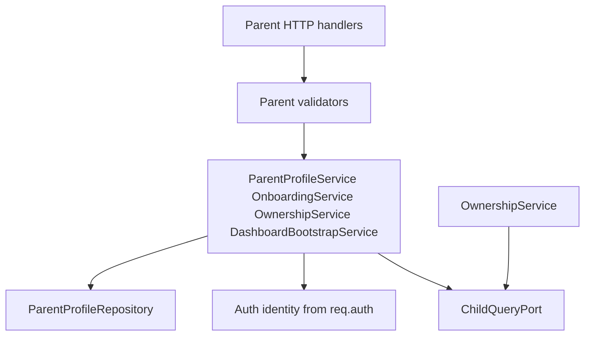
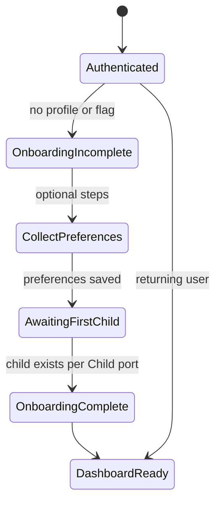
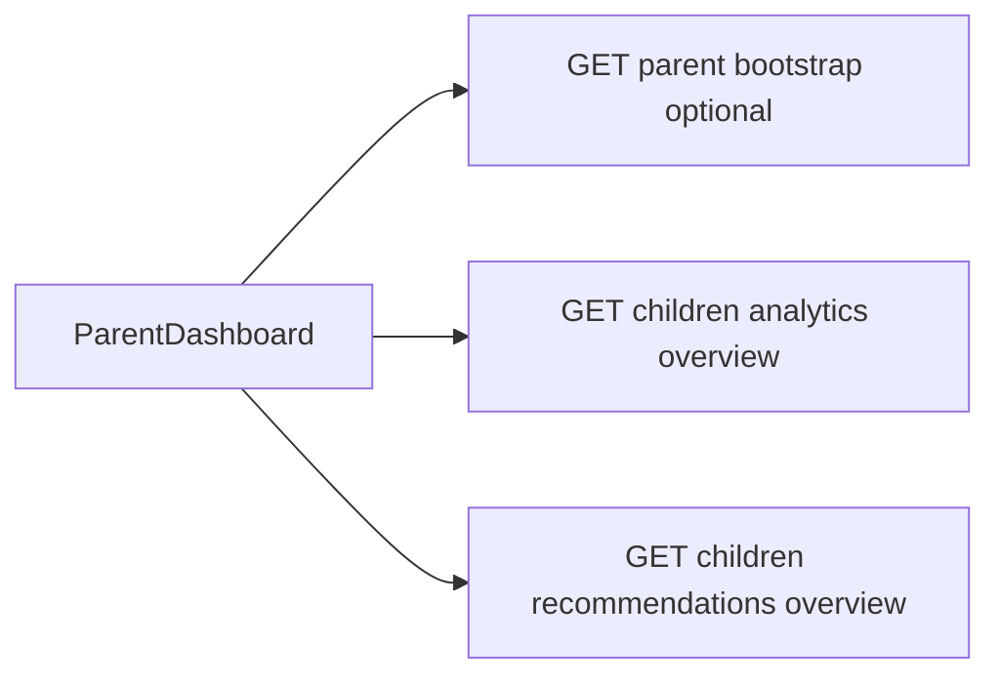
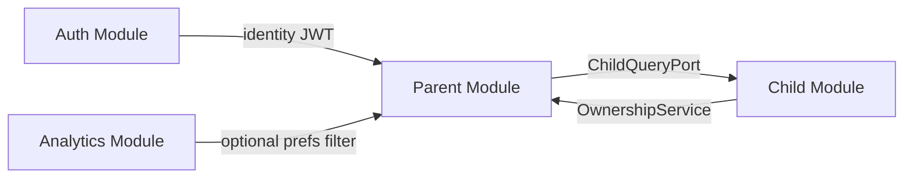

# Implementation Specification: Parent Module

**Version:** 1.0  
**Status:** Planning — no application code  
**Depends on:** Auth module (identity, JWT), Shared kernel  
**Depended on by:** Child module (ownership validation), Analytics (optional preference filters)  

---

## 1. Module responsibilities

### Owns

- **Parent profile** beyond core auth identity (display preferences, avatar if not on `users`)
- **Onboarding state** and structured **parent preferences** (notification toggles, learning goals, language, child interests — JSON document)
- **Parent-scoped read models** for dashboard **bootstrap metadata** (not analytics computation)
- **Parent–child ownership validation** as a reusable application service (used by Child/Quiz; Child still owns child writes)
- **Child creation initiation** workflow state (e.g. onboarding step “create first child”) — actual child insert remains **Child module**

### Does not own

- JWT issuance, OAuth, password verification → **Auth module**
- Child CRUD, username/PIN hashing, student credentials → **Child module**
- Quiz attempts, grading → **Quiz module**
- Analytics aggregations, recommendations, charts → **Analytics module**
- Rewards/XP logic → frontend + analytics inputs

### Public surface (other modules may call)

| Export | Consumer | Purpose |
|--------|----------|---------|
| `ParentOwnershipService.assertOwnsChild(parentId, childId)` | Child, Quiz, Analytics | Throws `403` if not owner |
| `ParentOwnershipService.listChildIds(parentId)` | Auth (optional) | Populate `childIds` on parent user DTO |
| `ParentProfileService.getProfile(parentId)` | Internal / HTTP | Profile reads |

---

## 2. Internal flow (layered)



| Layer | Responsibility |
|-------|----------------|
| HTTP handlers | `/api/parent/*` resources |
| Validators | Preferences JSON schema bounds |
| Services | Profile CRUD, onboarding flags, ownership checks, bootstrap aggregation |
| Repositories | `parent_profiles` (or equivalent) persistence |
| Ports | `ChildQueryPort.listByParentId`, `ChildQueryPort.existsForParent` |

---

## 3. Parent user journey (application flows)

### 3.1 Post-auth onboarding



**Onboarding is skippable** — parent can reach dashboard with zero children (FE already handles empty analytics).

### 3.2 Profile management

- Load profile on settings/dashboard entry.
- Update name, avatar, locale/language.
- Name also exposed via Auth `PUT /auth/profile` for FE compat — **Parent service is source of truth**; Auth handler delegates to `ParentProfileService.updateDisplayName`.

### 3.3 Child creation initiation

Parent module **does not** insert child rows.

| Step | Owner |
|------|-------|
| Parent UI “Add learner” form | FE [ParentSettings](../../../frontend/src/pages/parent/ParentSettings.tsx) |
| HTTP create child | **Child module** `POST /children` |
| Parent module role | Expose `GET /parent/onboarding` status; after Child creates record, onboarding service marks `hasChildren: true` |

Optional: `POST /parent/onboarding/complete` when parent dismisses wizard without child (FYP).

### 3.4 Dashboard compatibility layer

**Does not duplicate Analytics module.**

`DashboardBootstrapService` returns **lightweight session context** only:

| Field | Source |
|-------|--------|
| parent | profile DTO |
| preferences | notification flags, language |
| childrenSummary | id, name, grade from ChildQueryPort (not analytics) |
| onboarding | flags |
| activeChildSuggestion | first child id if none in client storage |

Full charts, recommendations, summaries remain `GET /children/analytics/overview` (Analytics module).



**Phase 1 FYP:** Bootstrap endpoint is **optional** if FE continues calling analytics directly — implement bootstrap only if it reduces duplicate fetches; otherwise Parent module focuses on profile/preferences/ownership.

**Recommendation:** Ship **profile + preferences APIs** first; add bootstrap in Parent Phase 1.2 if needed.

---

## 4. Middleware requirements

| Middleware | Applies to |
|------------|------------|
| `authenticate` | All `/api/parent/*` |
| `authorize('parent')` | All Parent routes |
| Admin | No Parent admin routes Phase 1 |

**Ownership middleware (route-level helper, not global)**

- `requireOwnsChild(paramChildId)` — reads `:childId`, calls `ParentOwnershipService.assertOwnsChild(req.auth.parentId, childId)`
- Used by Parent routes that accept child id; Child module duplicates check internally for writes (defense in depth).

Student tokens **must not** access Parent module routes.

---

## 5. Validation requirements

### Profile update

| Field | Rules |
|-------|-------|
| name | 1–255 trimmed (if accepted on parent profile endpoint) |
| avatarUrl | optional URL or emoji string max 500 |
| preferredLanguage | optional ISO 639-1 enum list: `en`, `ur`, etc. (FYP: free string max 10) |

### Preferences document (`ParentPreferencesDto`)

| Field | Type | Default |
|-------|------|---------|
| emailNotifications | boolean | true |
| weeklyReportEmail | boolean | false |
| learningGoals | string[] | max 10 items, each max 100 chars |
| childInterests | string[] | max 10 |
| preferredLanguage | string | optional |

**Reject** unknown keys if using strict schema, or strip unknown keys (prefer strip for forward compatibility).

### Onboarding update

| Field | Rules |
|-------|-------|
| completed | boolean |
| skipped | boolean |

Cannot set both `completed` and `skipped` false after onboarding was completed (idempotent updates allowed).

---

## 6. Service boundaries

### `ParentProfileService`

| Method | Description |
|--------|-------------|
| `getByParentId(parentId)` | Full profile + preferences |
| `updateProfile(parentId, dto)` | Partial update |
| `updateDisplayName(parentId, name)` | Called from Auth proxy |
| `ensureProfileExists(parentId)` | Create default row on first OAuth login (hook from Auth via event or direct call in callback orchestration) |

### `OnboardingService`

| Method | Description |
|--------|-------------|
| `getStatus(parentId)` | `{ completed, skipped, hasChildren, steps }` |
| `savePreferencesStep(parentId, prefsPartial)` | Merge preferences |
| `markComplete(parentId)` | Set onboarding complete |
| `markSkipped(parentId)` | Allow dashboard access |

### `ParentOwnershipService`

| Method | Description |
|--------|-------------|
| `assertOwnsChild(parentId, childId)` | Throw `FORBIDDEN` if ChildQueryPort denies |
| `listChildIds(parentId)` | For Auth `childIds` compat |
| `listChildrenSummary(parentId)` | Minimal list for bootstrap |

### `DashboardBootstrapService` (optional)

| Method | Description |
|--------|-------------|
| `getBootstrap(parentId)` | Aggregate profile + childrenSummary + onboarding |

### Ports (Child module implements)

**`ChildQueryPort`**

```
listByParentId(parentId) -> Array<{ id, name, gradeLevel, avatarUrl }>
existsForParent(parentId, childId) -> boolean
countByParentId(parentId) -> number
```

Parent module **never** writes to `children` table.

---

## 7. Repository responsibilities

### `ParentProfileRepository`

| Operation | Description |
|-----------|-------------|
| `findByParentId` | Single row per parent |
| `insertDefault` | On first parent login |
| `update` | Patch profile fields and preferences JSON |
| `updatePreferences` | JSON merge |

**Conceptual `parent_profiles` entity (migration in §14, not DDL)**

- `parent_id` FK → `users.id` (unique)
- `display_name` (optional override; else use `users.name`)
- `avatar_url`
- `preferred_language`
- `preferences` JSONB
- `onboarding_completed` boolean
- `onboarding_skipped` boolean
- `created_at`, `updated_at`

**Sync rule:** On Google OAuth first login, Auth orchestration calls `ParentProfileService.ensureProfileExists(parentId)`.

---

## 8. HTTP surface (contracts)

Base path: `/api/parent`  
Auth: Bearer parent JWT only.

### 8.1 Endpoints

| Method | Path | Purpose |
|--------|------|---------|
| GET | `/me` | Full parent profile + preferences + onboarding flags |
| PUT | `/me` | Update profile fields |
| PUT | `/me/preferences` | Replace or merge preferences document |
| GET | `/onboarding` | Onboarding status |
| PUT | `/onboarding` | Update onboarding step / complete / skip |
| GET | `/bootstrap` | Optional dashboard session bundle |
| GET | `/children` | **Not duplicate of Child module** — redirect/delegate doc only |

**Explicit non-goal:** `GET /api/parent/children` duplicates `GET /api/children`. Parent module does **not** expose child CRUD. FE continues using [children API](../../../frontend/src/api/children.ts) on Child routes.

### 8.2 Coordination with Auth routes

| Auth endpoint | Parent module role |
|---------------|-------------------|
| `PUT /auth/profile` { name } | Auth HTTP → `ParentProfileService.updateDisplayName` + sync `users.name` via Auth repo OR Parent repo only with Auth reading name from Parent on `me` |

**Chosen pattern (single source of truth):**

- `users.name` updated by Auth repository on profile name change.
- `parent_profiles.display_name` mirrors name OR deprecated in favor of `users.name` only.
- **FYP simplification:** Store name only on `users`; Parent profile stores preferences + onboarding only. `PUT /auth/profile` stays in Auth module updating `users.name`. Parent `PUT /me` updates avatar, language, preferences — **not** name, unless FE later uses Parent endpoint.

This matches current FE: [ParentSettings](../../../frontend/src/pages/parent/ParentSettings.tsx) uses `updateParentProfileName` → `PUT /auth/profile`.

### 8.3 Request DTOs

**`UpdateParentProfileRequest`**

| Field | Type | Required |
|-------|------|----------|
| avatarUrl | string | no |
| preferredLanguage | string | no |

**`UpdateParentPreferencesRequest`**

| Field | Type | Required |
|-------|------|----------|
| emailNotifications | boolean | no |
| weeklyReportEmail | boolean | no |
| learningGoals | string[] | no |
| childInterests | string[] | no |
| preferredLanguage | string | no |

Partial merge: unspecified keys unchanged.

**`UpdateOnboardingRequest`**

| Field | Type | Required |
|-------|------|----------|
| completed | boolean | no |
| skipped | boolean | no |
| preferences | `UpdateParentPreferencesRequest` | no |

### 8.4 Response DTOs (inside envelope `data`)

**`ParentProfileResponse`**

| Field | Type |
|-------|------|
| parentId | number |
| name | string | from Auth user |
| email | string |
| avatarUrl | string \| null |
| preferredLanguage | string \| null |
| preferences | `ParentPreferencesDto` |
| onboarding | `OnboardingStatusDto` |

**`OnboardingStatusDto`**

| Field | Type |
|-------|------|
| completed | boolean |
| skipped | boolean |
| hasChildren | boolean |
| suggestedNextStep | enum: `create_child` \| `set_preferences` \| `done` |

**`ParentBootstrapResponse`** (optional)

| Field | Type |
|-------|------|
| profile | `ParentProfileResponse` |
| children | `ChildSummaryDto[]` |
| defaultChildId | number \| null |

**`ChildSummaryDto`**

| Field | Type |
|-------|------|
| id | number |
| name | string |
| gradeLevel | string \| null |
| avatarUrl | string \| null |

---

## 9. Response envelope

Same global contract as Auth module.

Success example structure (conceptual):

```json
{
  "success": true,
  "message": "Profile loaded",
  "data": { "profile": { } }
}
```

Errors use `PARENT_*` codes:

| Code | HTTP |
|------|------|
| PARENT_FORBIDDEN | 403 |
| PARENT_NOT_FOUND | 404 |
| PARENT_VALIDATION_ERROR | 422 |

---

## 10. Frontend compatibility notes

| FE today | Target backend |
|----------|----------------|
| [ParentSettings](../../../frontend/src/pages/parent/ParentSettings.tsx) name save → `PUT /auth/profile` | Auth updates `users.name` — **no FE change** |
| [parentPreferences.ts](../../../frontend/src/lib/parentPreferences.ts) localStorage | Migrate to `GET/PUT /parent/me/preferences` in thin FE pass (optional Phase 1.7); until then localStorage still works |
| [ParentDashboard](../../../frontend/src/pages/parent/ParentDashboard.tsx) | Continues `fetchParentAnalyticsOverview` + recommendations — **Parent module does not replace** |
| [ParentSettings](../../../frontend/src/pages/parent/ParentSettings.tsx) child CRUD | Stays on Child `POST/GET/PUT/DELETE /children` |
| [activeChild.ts](../../../frontend/src/lib/activeChild.ts) | Unchanged; uses Child list endpoint |
| Onboarding UI | Not in FE yet — backend ready; FE can ignore until post-FYP |

**Dashboard compatibility layer = non-breaking:** Existing FE works without calling `/parent/bootstrap`.

**childIds on parent user (Auth):** Parent `OwnershipService.listChildIds` feeds Auth when building login/`me` response.

---

## 11. Dependency rules



| Rule | Detail |
|------|--------|
| Parent → Auth | Read `req.auth.parentId` only; no Auth repository import |
| Parent → Child | Query port only |
| Child → Parent | Ownership service for write authorization |
| Analytics → Parent | Optional read preferences; no write |
| Auth → Parent | `ensureProfileExists` on first login (orchestration in Auth callback service) |

---

## 12. Error handling strategy

| Case | Handling |
|------|----------|
| Profile not found | Auto-create default profile (lazy) — not 404 for parent `GET /me` |
| Child not owned | `403` `PARENT_FORBIDDEN` |
| Invalid preferences JSON | `422` with field errors |
| Child port unavailable | `503` on bootstrap only; profile endpoints still work |

Log parent id on errors; never log preferences content at info level (PII).

---

## 13. Migration strategy (ownership, not DDL)

| Migration unit | Owner | Conceptual content |
|----------------|-------|-------------------|
| `parent_001_profiles` | Parent module | `parent_profiles` table keyed by `parent_id` |
| Seed | Parent/ops | Default preferences for demo parent |

**Rules**

- Parent migrations never alter `users` table (Auth owns).
- FK from `parent_profiles.parent_id` → `users.id` ON DELETE CASCADE.

---

## 14. Phased implementation order (Parent module)

| Step | Deliverable | Depends on |
|------|-------------|------------|
| P1 | `ParentProfileRepository` + `ensureProfileExists` hook from Auth OAuth | Auth A4 |
| P2 | `GET /parent/me`, `PUT /parent/me/preferences` | P1 |
| P3 | `OnboardingService` + `GET/PUT /parent/onboarding` | P2 |
| P4 | `ParentOwnershipService` + ChildQueryPort (mock then real) | Child module or mock |
| P5 | Auth `me` + login populate `childIds` via `listChildIds` | P4 |
| P6 | Optional `GET /parent/bootstrap` | P4 |
| P7 | FE: switch preferences from localStorage to API (thin) | P2 |

**Parallel with Auth:** P1 can start after Auth `UserRepository` exists.

---

## 15. Interaction matrix: Auth + Parent (implementation planning)

| Concern | Auth | Parent |
|---------|------|--------|
| Google login | OAuth + user upsert | `ensureProfileExists` |
| Email login | verify + JWT | same profile ensure |
| Display name | `PUT /auth/profile` | optional mirror; users.name canonical |
| Preferences | — | `PUT /parent/me/preferences` |
| JWT claims | parentId = users.id | — |
| childIds in user DTO | build token response | `listChildIds` |
| Student login | full | no access |

---

## 16. Acceptance criteria (Parent module sign-off)

- [ ] First-time Google parent gets default `parent_profiles` row
- [ ] `GET /parent/me` returns preferences matching `ParentPreferencesDto`
- [ ] `PUT /parent/me/preferences` persists and survives reload
- [ ] Onboarding flags updatable without child present
- [ ] `ParentOwnershipService` blocks access to another parent’s child id
- [ ] Auth `GET /me` can include `childIds` when Child port wired
- [ ] No child CRUD in Parent module
- [ ] Parent dashboard still works via Analytics endpoints without requiring bootstrap
- [ ] No business logic in HTTP handlers beyond delegation

---

## 17. Out of scope (Parent module)

- Subscription/billing settings UI fields (FE shows demo disabled buttons)
- Email sending for `emailNotifications` toggle
- Admin parent management
- Emotional intelligence data
- Analytics computation

---

## 18. Next modules (after Auth + Parent approval)

| Module | Spec status |
|--------|-------------|
| Child | [03-child-module.md](./03-child-module.md) — CRUD, username/PIN, port implementations |
| Quiz | Pending — catalog + attempts |
| Analytics compatibility | Pending |
| Rewards compatibility | Pending |
