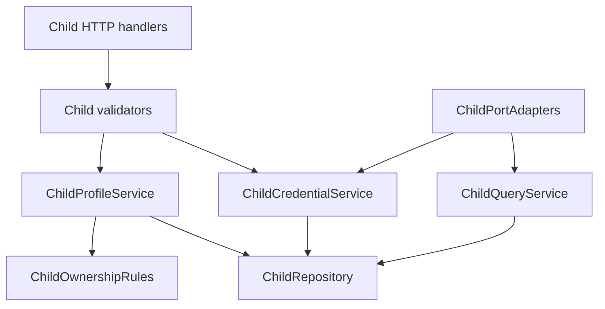
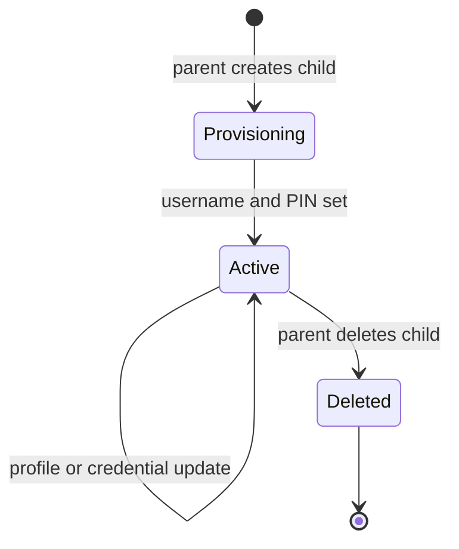
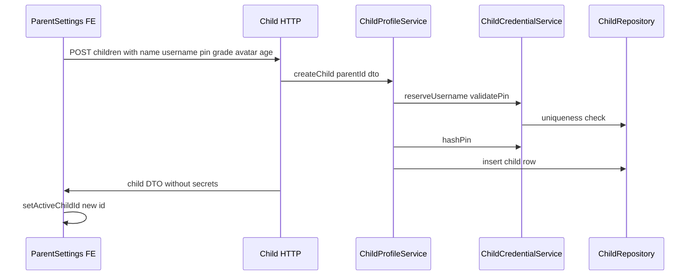
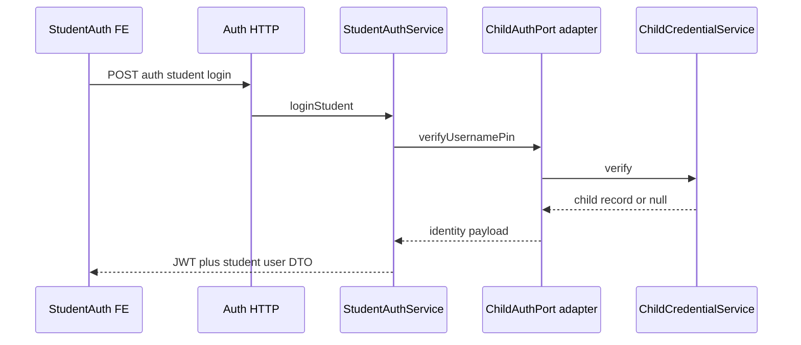
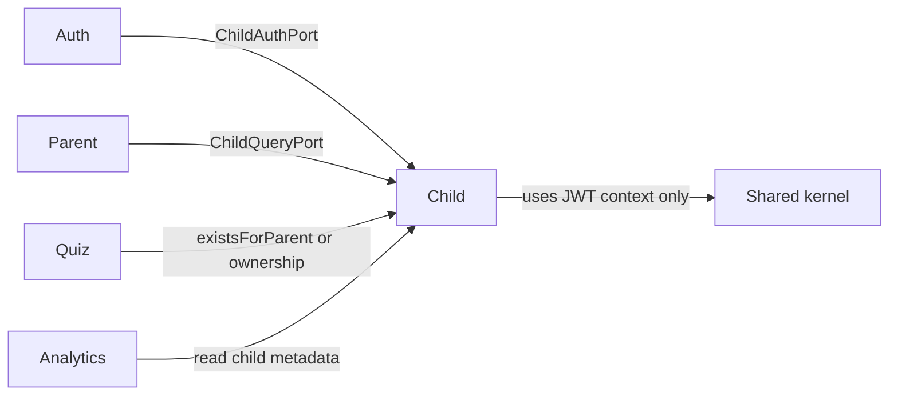

# Implementation Specification: Child Module

**Version:** 1.0  
**Status:** Ready for review — no application code  
**Depends on:** Shared kernel, Auth module (JWT middleware), Parent module (`ParentOwnershipService` optional duplicate check — Child owns authoritative ownership)  
**Depended on by:** Auth (`ChildAuthPort`), Parent (`ChildQueryPort`), Quiz (attempt `child_id`), Analytics, Rewards compatibility  

---

## 0. Module responsibilities

### Owns (system of record)

- **Child profile** persistence and lifecycle (create, read, update, delete)
- **Parent–child linkage** (`parent_id` on every child row)
- **Student credentials:** globally unique `username`, **PIN/password hash** (never plain text at rest or in API responses)
- **Display metadata:** name, avatar, age (or date of birth), grade level
- **Child-scoped preferences** (`learning_preferences` JSON document — distinct from parent onboarding prefs in Parent module)
- **Port implementations:** `ChildAuthPort`, `ChildQueryPort` (contracts consumed by Auth and Parent)

### Does not own

| Concern | Owner |
|---------|--------|
| JWT issuance, OAuth, `authenticate` / `authorize` | Auth module |
| Parent profile, parent notification prefs, onboarding flags | Parent module |
| Quiz attempts, grading, timing rows | Quiz module (references `child_id`) |
| Analytics aggregations, learning-speed signals | Analytics module |
| Rewards / XP / badge math | Frontend + analytics inputs (Rewards compatibility spec) |
| Active child selection in browser | Frontend [activeChild.ts](../../../frontend/src/lib/activeChild.ts) (localStorage only) |

### Powers (downstream consumers)

| Consumer | Use |
|----------|-----|
| Auth | `ChildAuthPort.verifyUsernamePin` for `POST /auth/student/login` |
| Parent | `ChildQueryPort` for ownership checks, `childIds`, bootstrap summaries |
| Quiz | Validates `child_id` belongs to parent before start/submit |
| Analytics | Reads child identity (id, name, grade) for bundle headers |
| Student UI | Profile avatar/grade/level via child + analytics |

---

## 1. Forbidden boundaries

- **No** import of Auth `UserRepository` or JWT signing.
- **No** analytics SQL or recommendation scoring in Child services.
- **No** rewards ledger or XP tables.
- **No** Google OAuth or provider ids on `children` rows.
- **No** duplicate `GET /api/parent/children` — HTTP surface remains **`/api/children`** per existing FE.
- **No** returning `pin_hash` or raw PIN in any response DTO.
- Child module **must not** call Parent repositories; may call `ParentOwnershipService` only if ownership is centralized there — **preferred:** Child enforces ownership internally via `ChildOwnershipRules` + `parent_id` on row (Parent’s `assertOwnsChild` delegates to `ChildQueryPort.existsForParent` implemented here).

---

## 2. Layered internal flow



| Layer | Responsibility |
|-------|----------------|
| HTTP handlers | `/api/children` resources; map envelope; select HTTP status |
| Validators | Request DTO schemas; reject before services |
| `ChildProfileService` | CRUD orchestration, preferences merge, delete policy |
| `ChildCredentialService` | Username uniqueness, PIN hash on create/update, verify for port |
| `ChildOwnershipRules` | `assertParentOwnsChild(parentId, childId)` for HTTP and internal use |
| `ChildQueryService` | Read models for lists, port methods, existence checks |
| `ChildPortAdapters` | Thin classes implementing `ChildAuthPort` / `ChildQueryPort` registered at app bootstrap |
| `ChildRepository` | All SQL for `children` table |

**Rule:** HTTP handlers do not call `ChildRepository` directly.

---

## 3. Child lifecycle



| State | Meaning |
|-------|---------|
| **Provisioning** | Row exists; credentials may be set in same request as create |
| **Active** | Student may log in; quizzes may attach `child_id` |
| **Deleted** | Row removed (hard delete MVP); dependent attempts removed by DB cascade (Quiz migrations) |

**Archive strategy (Phase 1 / FYP):** **Hard delete** when parent confirms removal (matches FE copy: “Quiz history for this child will be deleted”).  

**Phase 2 optional:** `status = archived` soft delete with hidden list — not in Phase 1 scope.

**Inactive flag (optional):** `is_active` boolean to block student login without deleting — defer unless needed; PIN rotation sufficient for lockout.

---

## 4. Parent–child ownership model

| Rule | Enforcement |
|------|-------------|
| Every child row has exactly one `parent_id` | DB NOT NULL FK → `users.id` |
| Parent JWT may only CRUD children where `parent_id = req.auth.parentId` | `ChildOwnershipRules` on every mutating route |
| Student JWT may read **only** their own child record (`childId` claim) | Optional `GET` self profile; no list, no create |
| Admin (future) | Bypass via separate admin routes — not Child Phase 1 |
| Cross-parent access | Always `403` `CHILD_FORBIDDEN` |

**Quiz / Analytics:** They receive `childId` from path or body; caller modules must still verify ownership (Quiz calls `ChildQueryPort.existsForParent` or shared ownership helper).

---

## 5. Application flows

### 5.1 Parent — create child



**Post-create:** FE sets active learner in localStorage ([setActiveChildId](../../../frontend/src/lib/activeChild.ts)) — server does not track “active child.”

### 5.2 Parent — update child

- Partial update: name, grade, avatar, age/DOB, preferences.
- Credential update: optional `pin` (rotate) or `username` (rare; uniqueness re-check).
- PIN never echoed in response.

### 5.3 Parent — delete child

- Confirm ownership → hard delete → return success envelope.
- FE clears active child if deleted id matches ([ParentSettings](../../../frontend/src/pages/parent/ParentSettings.tsx) behavior).

### 5.4 Parent — list / get

- `GET /children` → all children for `req.auth.parentId`, ordered by `created_at`.
- `GET /children/:id` → single child if owned.

### 5.5 Student — login (via Auth, Child port)



Child module does not issue JWT.

### 5.6 Active child & dashboard switching (compatibility)

| Mechanism | Owner |
|-----------|--------|
| `klp-active-child-id` in localStorage | Frontend only |
| `resolveActiveChildId()` | FE validates stored id against `GET /children` list |
| Parent dashboard `<select>` child switch | FE `selectedChildId` state + optional `setActiveChildId` |
| Server-side “active child” session | **Not used** Phase 1 |

**Implication:** Child module provides **accurate child lists and ids**; switching is a client concern.

### 5.7 Child dashboard identity model (student-facing)

When student session exists (JWT `role=student`, `childId`):

| UI need | Source |
|---------|--------|
| Display name, avatar | Child profile (`GET /children/:id` self) or Auth user DTO at login |
| Level / XP / badges | Analytics + [rewardsFromAnalytics.ts](../../../frontend/src/lib/rewardsFromAnalytics.ts) — not Child |
| Theme age band (4–7 vs 8–12) | FE [ThemeContext](../../../frontend/src/context/ThemeContext.tsx) from `user.age` — map from child `age` at login in Auth DTO |
| Recommended quizzes | Analytics/Recommendation APIs scoped by `childId` |

**Student identity rule:** `AuthUserDto.id` for student = **`childId`** (numeric stringified) so existing FE `User.id` works.

---

## 6. Middleware requirements

| Route group | Middleware |
|-------------|------------|
| `POST/GET/PUT/DELETE /api/children` | `authenticate` + `authorize('parent')` |
| `GET /api/children/:id` (student self-read) | `authenticate` + `authorize('student')` + handler verifies `params.id === req.auth.childId` |
| Port calls (internal) | No HTTP middleware |

**Rate limiting:** Apply to credential verification path indirectly via Auth student login limiter; optional limit on child create (e.g. max 10 children per parent) at service level.

---

## 7. Validation requirements

### Username

| Rule | Value |
|------|--------|
| Required on create | Yes (for student login readiness) |
| Pattern | `^[a-zA-Z0-9_]{3,32}$` |
| Uniqueness | Global across all children |
| Case | Store normalized lowercase |
| Change on update | Allowed; same uniqueness rules |

### PIN / password

| Rule | Value |
|------|--------|
| Required on create | Yes |
| Format | 4–6 digits (PIN) for FYP; allow 4–32 char password later with flag |
| Storage | bcrypt cost 12; field `pin_hash` |
| Update | Optional field on PUT; re-hash |
| Responses | Never include PIN or hash |

### Profile fields

| Field | Rules |
|-------|--------|
| name | 1–255 trimmed, required on create |
| grade_level | optional, max 50 chars |
| avatar_url | optional; emoji or URL string max 500 |
| age | optional integer 4–12 (align product); OR `date_of_birth` ISO date — **support both; prefer `age` for FE theme compat** |
| learning_preferences | JSON object; max depth/size bounded (e.g. 8KB serialized) |

### Ownership

| Check | When |
|-------|------|
| `parentId` from JWT matches row.parent_id | All parent mutations |
| `childId` exists | Get/update/delete |
| Duplicate username | Create/update → `409` or `400` `CHILD_USERNAME_TAKEN` |

### Delete

| Rule | Value |
|------|--------|
| Parent confirmation | FE responsibility (confirm dialog exists) |
| Cascade | Child deletion removes dependent rows per Quiz migration FK policy (document coordination in Quiz spec) |

---

## 8. Service boundaries

### `ChildProfileService`

| Method | Responsibility |
|--------|----------------|
| `createChild(parentId, dto)` | Validate, delegate credentials, insert, return public DTO |
| `getChildForParent(parentId, childId)` | Ownership + DTO |
| `listChildrenForParent(parentId)` | List DTOs for FE list |
| `updateChild(parentId, childId, dto)` | Partial profile + optional prefs |
| `deleteChild(parentId, childId)` | Hard delete |
| `getChildForStudent(childId)` | Student self-read (no parent id param) |
| `updateChildPreferences(parentId, childId, prefs)` | JSON merge |

### `ChildCredentialService`

| Method | Responsibility |
|--------|----------------|
| `assignCredentials(childId, username, pin)` | Hash and persist |
| `updateUsername(childId, username)` | Uniqueness |
| `rotatePin(childId, pin)` | Re-hash |
| `verifyUsernamePin(username, pin)` | Constant-time compare; return verify result for port |
| `isUsernameAvailable(username, excludeChildId?)` | Create/update |

### `ChildOwnershipRules`

| Method | Responsibility |
|--------|----------------|
| `assertParentOwnsChild(parentId, childId)` | Throw `CHILD_FORBIDDEN` if mismatch |
| `resolveParentIdForChild(childId)` | Internal; for Quiz/Analytics guards |

### `ChildQueryService`

| Method | Responsibility |
|--------|----------------|
| `listByParentId(parentId)` | Implements `ChildQueryPort` |
| `existsForParent(parentId, childId)` | Implements `ChildQueryPort` |
| `countByParentId(parentId)` | Implements `ChildQueryPort` |
| `listChildIdsForParent(parentId)` | For Auth `childIds` array on login/me |

---

## 9. Port implementations (required)

Ports are defined in **Child module** and **registered** in application composition root so Auth/Parent depend on interfaces, not concrete classes.

### `ChildAuthPort` (Auth spec contract)

```
verifyUsernamePin(username: string, pin: string) =>
  | {
      childId: number
      name: string
      gradeLevel: string | null
      avatarUrl: string | null
      parentId: number
      age: number | null
    }
  | null
```

| Implementation | `ChildAuthPortAdapter` → `ChildCredentialService.verifyUsernamePin` |
| Failure | Return `null` (Auth maps to generic invalid credentials) |
| Active-only | Reject login if child deleted or `is_active=false` when flag exists |

### `ChildQueryPort` (Parent spec contract)

```
listByParentId(parentId) =>
  Array<{ id, name, gradeLevel, avatarUrl }>

existsForParent(parentId, childId) => boolean

countByParentId(parentId) => number
```

| Implementation | `ChildQueryPortAdapter` → `ChildQueryService` |
| Mapping | DB `grade_level` → `gradeLevel`; `avatar_url` → `avatarUrl` |

### Port registration (planning)

At app bootstrap: `container.registerChildPorts({ childAuthPort, childQueryPort })` consumed by Auth and Parent module factories. No circular dependency: Child does not import Auth service classes.

---

## 10. Repository responsibilities

### `ChildRepository`

| Operation | Notes |
|-----------|--------|
| `insert` | All columns including `pin_hash`, `username` |
| `findById` | Internal |
| `findByIdAndParentId` | Parent-scoped read |
| `findByUsername` | Login uniqueness |
| `listByParentId` | Ordered by created_at ASC (matches FE default first child) |
| `update` | Dynamic patch |
| `deleteByIdAndParentId` | Hard delete |
| `countByParentId` | Onboarding port |

**Conceptual `children` entity (migration ownership §15, not DDL)**

| Field | Purpose |
|-------|---------|
| id | PK |
| parent_id | FK → users |
| name | Display name |
| username | Unique login |
| pin_hash | Credential |
| age | Optional 4–12 |
| date_of_birth | Optional alternative |
| grade_level | String |
| avatar_url | Emoji or URL |
| learning_preferences | JSONB |
| created_at, updated_at | Audit |

**Excluded:** `google_id`, `email`, reward points, analytics caches.

---

## 11. HTTP surface (contracts)

Base path: `/api/children`  
Envelope: global `success` / `message` / `data` (see Auth spec §10).

### 11.1 Endpoints

| Method | Path | Auth | Purpose |
|--------|------|------|---------|
| GET | `/` | Parent | List parent’s children |
| POST | `/` | Parent | Create child |
| GET | `/:id` | Parent (owner) or Student (self) | Get one child |
| PUT | `/:id` | Parent (owner) | Update profile/credentials/prefs |
| DELETE | `/:id` | Parent (owner) | Hard delete |

**No** `/api/children/active` — active child stays client-side.

### 11.2 Request DTOs

**`CreateChildRequest`** (extends current FE payload + required credentials)

| Field | Type | Required | Notes |
|-------|------|----------|-------|
| name | string | yes | |
| username | string | yes | New for target flow; thin FE add on create form |
| pin | string | yes | Sent once; never stored plain |
| grade_level | string | no | Snake case for FE compat |
| avatar_url | string | no | |
| age | number | no | 4–12 |
| date_of_birth | string (ISO date) | no | Alternative to age |
| learning_preferences | object | no | |

**`UpdateChildRequest`** (partial)

| Field | Type | Required |
|-------|------|----------|
| name | string | no |
| username | string | no |
| pin | string | no | Rotates credential |
| grade_level | string | no |
| avatar_url | string | no |
| age | number | no |
| learning_preferences | object | no |

### 11.3 Response DTOs

**`ChildResponse`** (single child — matches [children.ts](../../../frontend/src/api/children.ts) `ChildProfile` + extensions)

| Field | Type | In responses |
|-------|------|--------------|
| id | number | yes |
| name | string | yes |
| username | string | yes | Omit from list if FE not ready — **recommended include** for parent settings |
| grade_level | string \| null | yes (snake_case for existing FE extractors) |
| avatar_url | string \| null | yes |
| age | number \| null | optional |
| date_of_birth | string \| null | optional |
| learning_preferences | object \| null | yes |
| pin / pin_hash | — | **never** |

**`ChildListResponse`**

| Field | Type |
|-------|------|
| children | `ChildResponse[]` |

Wrapped in envelope as `data: { children }` or `data: { child }` per operation.

**List item minimum for [activeChild.ts](../../../frontend/src/lib/activeChild.ts):** `id`, `name`, `grade_level` required.

### 11.4 Error codes

| Code | HTTP | When |
|------|------|------|
| CHILD_FORBIDDEN | 403 | Wrong parent or student accessing other child |
| CHILD_NOT_FOUND | 404 | Unknown id (or not owned — prefer 404 over 403 for enumeration safety on parent get) |
| CHILD_USERNAME_TAKEN | 409 | Duplicate username |
| CHILD_VALIDATION_ERROR | 422 | Schema failures |
| CHILD_LIMIT_REACHED | 400 | Optional max children per parent |

---

## 12. Frontend compatibility notes

### Existing APIs ([children.ts](../../../frontend/src/api/children.ts))

| FE function | Backend | Compat notes |
|-------------|---------|--------------|
| `fetchChildrenForParent` | `GET /children` | Returns `{ children: [...] }` in `data` after unwrap |
| `createChildProfile` | `POST /children` | Add `username`, `pin` in thin FE pass |
| `updateChildProfile` | `PUT /children/:id` | grade, avatar unchanged |
| `deleteChildProfile` | `DELETE /children/:id` | |
| `fetchChildProfile` | `GET /children/:id` | Student profile page |

**Extractor:** `extractChild` expects `data.child` — envelope unwrap + handler must nest `child` object.

### Active child ([activeChild.ts](../../../frontend/src/lib/activeChild.ts))

| Behavior | Action |
|----------|--------|
| `fetchChildrenForParent` | Must return stable numeric `id` |
| `resolveActiveChildId` | First child when no valid stored id — preserve server order `created_at ASC` |
| `primeActiveChildFromApi` | Called after parent login in [AuthContext](../../../frontend/src/context/AuthContext.tsx) — list must succeed |

### Parent UI

| Screen | Compat |
|--------|--------|
| [ParentSettings](../../../frontend/src/pages/parent/ParentSettings.tsx) | CRUD + active badge; extend create form with username/PIN fields only |
| [ParentDashboard](../../../frontend/src/pages/parent/ParentDashboard.tsx) | Child switcher uses analytics overview children array — ids must match Child records |

### Student UI

| Screen | Compat |
|--------|--------|
| [StudentAuth](../../../frontend/src/pages/auth/StudentAuth.tsx) | Replace `loginStudentByName` with `POST /auth/student/login` + username/PIN fields |
| [StudentProfile](../../../frontend/src/pages/student/StudentProfile.tsx) | Avatar update via `PUT /children/:id` with parent token **or** student token (self) |
| [StudentRewards](../../../frontend/src/pages/student/StudentRewards.tsx) | Uses `resolveActiveChildId` + analytics — requires parent session or student token policy documented in Quiz spec |
| [StudentDashboard](../../../frontend/src/pages/student/StudentDashboard.tsx) | Same |

**Session policy (planning):** For FYP demo, parent logs in, selects child, student quizzes run with parent JWT + `child_id` **until** student JWT path is complete. Student JWT path: student login → `childId` in token → Quiz/Analytics accept `role=student`. Document in Quiz spec; Child module supplies identity only.

### Analytics / rewards

| Module | Child provides |
|--------|----------------|
| Analytics | `child.id`, `name`, `gradeLevel` in bundle header (Analytics maps from Child read) |
| Rewards | No Child API; analytics `completedAttempts` etc. |

### Snake_case vs camelCase

| Layer | Convention |
|-------|------------|
| `/api/children` JSON | **snake_case** for `grade_level`, `avatar_url` (existing FE types) |
| Port / internal | camelCase |
| Analytics child header | `gradeLevel` — mapping in Analytics module from Child row |

---

## 13. Dependency rules



| From | To | Allowed |
|------|-----|---------|
| Child | Auth | **No** repository/service imports |
| Child | Parent | **No** imports; Parent calls Child port |
| Auth | Child | Port interface only |
| Parent | Child | Port interface only |
| Quiz | Child | Port or shared ownership helper |

---

## 14. Error handling strategy

| Layer | Pattern |
|-------|---------|
| Validators | `ValidationError` → 422 `CHILD_VALIDATION_ERROR` |
| Ownership | `ChildForbiddenError` → 403 |
| Not found | `ChildNotFoundError` → 404 |
| Username conflict | `ChildConflictError` → 409 |
| Unexpected | 500 generic message |

**Security:** Same message for wrong username vs wrong PIN at Auth layer; Child port returns `null` on any credential failure.

**Logging:** Log child id + parent id on errors; never log PIN or hash.

---

## 15. Migration strategy (ownership, not DDL)

| Migration unit | Owner | Conceptual content |
|----------------|-------|-------------------|
| `child_001_children` | Child module | `children` table with parent FK, username unique, pin_hash, profile fields, preferences JSONB |
| Quiz FK coordination | Quiz module | `quiz_attempts.child_id` REFERENCES children ON DELETE CASCADE |

**Rules**

- Child migrations live under `backend/db/migrations/` prefixed `child_`.
- Auth `users` table untouched by Child migrations.
- Seed: demo child with known username/PIN for FYP (document in README, not in spec code).

---

## 16. Phased implementation order (Child module only)

| Step | Deliverable | Depends on | Verification |
|------|-------------|------------|--------------|
| C1 | `ChildRepository` + migration ownership applied | Shared kernel | Insert/list by parent |
| C2 | `ChildProfileService` create/list/get/update/delete | C1 | Postman parent CRUD |
| C3 | `ChildCredentialService` + username/PIN rules | C2 | Hash verify unit tests |
| C4 | `ChildAuthPortAdapter` wired to Auth | C3 | Student login E2E with Auth A6 |
| C5 | `ChildQueryPortAdapter` wired to Parent | C2 | `childIds` on Auth me |
| C6 | HTTP routes + validators + envelope | C2–C5 | FE ParentSettings list/create/delete |
| C7 | Student self `GET /children/:id` | C6 | StudentProfile avatar |
| C8 | Thin FE: username/PIN on create, student login API | C4, C6 | End-to-end demo |

**Parallel:** C6 can start after C2 for parent-only CRUD without student login.

---

## 17. Acceptance criteria (Child module sign-off)

- [ ] Parent can create child with name, username, PIN, grade, avatar, age
- [ ] Parent can list, update, delete only owned children
- [ ] Username globally unique; duplicate returns clear error
- [ ] PIN never returned in API responses
- [ ] `ChildAuthPort.verifyUsernamePin` returns identity for Auth student login
- [ ] `ChildQueryPort` satisfies Parent ownership and Auth `childIds` list
- [ ] `GET /children` response compatible with [activeChild.ts](../../../frontend/src/lib/activeChild.ts) extractors
- [ ] `POST/PUT/DELETE /children` compatible with [children.ts](../../../frontend/src/api/children.ts) extractors
- [ ] Hard delete cascades to attempts per Quiz migration agreement
- [ ] No JWT, analytics, or rewards logic inside Child module
- [ ] No business logic in HTTP handlers beyond delegation

---

## 18. Coordination with adjacent specs

| Topic | Resolution |
|-------|------------|
| Auth `POST /auth/student/login` | Uses `ChildAuthPort` — Child C4 |
| Parent `listChildIds` | `ChildQueryPort` — Child C5 |
| Parent onboarding `hasChildren` | `countByParentId > 0` |
| Quiz `child_id` in body | Quiz spec validates via `existsForParent` |
| Analytics child header | Reads child row by id; Child does not compute analytics |
| Rewards | No Child endpoints |

---

## 19. Out of scope (Child module)

- Google login for children
- Parent notification email delivery
- Student self-registration (signup) without parent — parent must create profile
- Server-side active child session
- Bulk import / CSV
- Multi-parent guardianship

---

## 20. Next specs (after Child approval)

| Document | Focus |
|----------|--------|
| [04-quiz-module.md](./04-quiz-module.md) | Catalog, attempts, `child_id` authorization |
| [05-analytics-compatibility.md](./05-analytics-compatibility.md) | FE analytics types, compute-on-read |
| [06-rewards-compatibility.md](./06-rewards-compatibility.md) | Analytics-derived gamification inputs |

Adaptive engine and advanced AI remain deferred until core compatibility modules are stable.
